# RAGLab

A complete Retrieval-Augmented Generation pipeline built from scratch to deeply understand RAG concepts and compare the effect of different configurations in chunking, searching and preprocessing techniques.

Study done over two fields of knowledge, neuroscience and practical wisdom philosophy, using 19 books and testing with handcrafted evaluation questions done with Anthorpic Opus 4.5 after reading all the books.

### Workflow

```mermaid
flowchart TB
    %% ============================================================
    %% RAGLAB COMPLETE PIPELINE DIAGRAM
    %% From PDF to Answer with all experimental techniques
    %% ============================================================

    %% === INPUT ===
    subgraph INPUT["📚 Corpus"]
        PDF[("19 PDF Books<br/>~700k tokens")]
    end

    %% === PHASE 1: CONTENT PREPARATION ===
    subgraph PREP["Phase 1: Content Preparation"]
        direction TB

        subgraph S1["Stage 1: Extract"]
            DOCLING["Docling<br/>PDF → Markdown"]
        end

        subgraph S2["Stage 2: Clean"]
            CLEAN["Regex Pipeline<br/>Remove artifacts"]
        end

        subgraph S3["Stage 3: Segment"]
            SPACY["spaCy NLP<br/>Sentence boundaries"]
        end

        S1 --> S2 --> S3
    end

    %% === PHASE 2: CHUNKING STRATEGIES ===
    subgraph CHUNK["Phase 2: Chunking Strategies"]
        direction TB

        CHUNK_IN(["Segmented Text"])

        subgraph CHUNK_OPTS["Choose Strategy"]
            direction LR
            SEC["<b>Fixed-Size</b><br/>800 tokens<br/>2-sent overlap"]
            SEM["<b>Semantic</b><br/>Similarity<br/>breakpoints"]
            CTX["<b>Contextual</b><br/>LLM context<br/>prepended"]
            RAP["<b>RAPTOR</b><br/>Hierarchical<br/>summaries"]
        end

        CHUNK_IN --> CHUNK_OPTS

        SEC --> CHUNKS_OUT
        SEM --> CHUNKS_OUT
        CTX --> CHUNKS_OUT
        RAP --> CHUNKS_OUT

        CHUNKS_OUT(["Chunks + Metadata"])
    end

    %% === GRAPHRAG BRANCH ===
    subgraph GRAPH["GraphRAG Pipeline"]
        direction TB

        subgraph EXTRACT["Entity Extraction"]
            AUTOTUNE["Auto-Tuning<br/>Discover types"]
            FIXED["Predefined<br/>14 entity types"]
        end

        NEO4J[("Neo4j<br/>Knowledge Graph")]
        LEIDEN["Leiden<br/>Communities"]
        COMM_SUM["Community<br/>Summaries"]

        AUTOTUNE --> NEO4J
        FIXED --> NEO4J
        NEO4J --> LEIDEN --> COMM_SUM
    end

    %% === EMBEDDING & INDEXING ===
    subgraph INDEX["Phase 3: Embed & Index"]
        direction TB

        EMBED["OpenRouter API<br/>text-embedding-3-large<br/>3072 dimensions"]
        WEAVIATE[("Weaviate<br/>HNSW Index<br/>+ BM25")]
        COMM_VEC[("Community<br/>Vectors")]

        EMBED --> WEAVIATE
        EMBED --> COMM_VEC
    end

    %% === QUERY PREPROCESSING ===
    subgraph PREPROC["Phase 4: Query Preprocessing"]
        direction TB

        QUERY_IN["User Query"]

        subgraph PREPROC_OPTS["Choose Strategy"]
            direction LR
            NONE["<b>None</b><br/>Direct query"]
            HYDE["<b>HyDE</b><br/>Hypothetical<br/>document"]
            DECOMP["<b>Decomposition</b><br/>Sub-questions<br/>+ RRF"]
            GRAPHQ["<b>GraphRAG</b><br/>Entity lookup<br/>+ traversal"]
        end

        QUERY_IN --> PREPROC_OPTS
    end

    %% === RETRIEVAL ===
    subgraph RETRIEVE["Phase 5: Retrieval"]
        direction TB

        subgraph SEARCH_TYPE["Search Method"]
            direction LR
            KW["<b>Keyword</b><br/>BM25"]
            HYB["<b>Hybrid</b><br/>α-weighted<br/>vector + BM25"]
        end

        RERANK["Cross-Encoder<br/>Reranking<br/><i>(optional)</i>"]
        RRF["RRF Merge<br/><i>(multi-query)</i>"]

        SEARCH_TYPE --> RRF
        RRF --> RERANK
        RERANK --> CONTEXTS

        CONTEXTS(["Retrieved Contexts<br/>top-k chunks"])
    end

    %% === GENERATION ===
    subgraph GEN["Phase 6: Generation"]
        direction TB

        SYNTH["LLM Synthesis<br/>DeepSeek V3<br/>with citations"]
        ANSWER(["Final Answer<br/>with [1][2] refs"])

        SYNTH --> ANSWER
    end

    %% === EVALUATION ===
    subgraph EVAL["Phase 7: Evaluation"]
        direction LR

        subgraph RAGAS["RAGAS Framework"]
            direction TB
            FAITH["Faithfulness"]
            REL["Relevancy"]
            PREC["Context Precision"]
            REC["Context Recall"]
            CORR["Answer Correctness"]
        end

        GRID["5D Grid Search<br/>84 combinations"]
    end

    %% === CONNECTIONS ===
    PDF --> PREP
    PREP --> CHUNK

    CHUNKS_OUT --> GRAPH
    CHUNKS_OUT --> INDEX

    COMM_SUM --> COMM_VEC
    GRAPH -.->|"entity context"| RETRIEVE

    PREPROC --> RETRIEVE
    INDEX --> RETRIEVE
    COMM_VEC -.->|"community search"| RETRIEVE

    CONTEXTS --> GEN
    ANSWER --> EVAL

    %% === STYLING ===
    classDef inputStyle fill:#e1f5fe,stroke:#01579b,stroke-width:2px
    classDef prepStyle fill:#f3e5f5,stroke:#4a148c,stroke-width:2px
    classDef chunkStyle fill:#e8f5e9,stroke:#1b5e20,stroke-width:2px
    classDef graphStyle fill:#fff3e0,stroke:#e65100,stroke-width:2px
    classDef indexStyle fill:#e3f2fd,stroke:#0d47a1,stroke-width:2px
    classDef queryStyle fill:#fce4ec,stroke:#880e4f,stroke-width:2px
    classDef retrieveStyle fill:#f1f8e9,stroke:#33691e,stroke-width:2px
    classDef genStyle fill:#ede7f6,stroke:#311b92,stroke-width:2px
    classDef evalStyle fill:#fff8e1,stroke:#f57f17,stroke-width:2px
    classDef dbStyle fill:#eceff1,stroke:#37474f,stroke-width:3px

    class INPUT inputStyle
    class PREP,S1,S2,S3 prepStyle
    class CHUNK,CHUNK_OPTS chunkStyle
    class GRAPH,EXTRACT graphStyle
    class INDEX indexStyle
    class PREPROC,PREPROC_OPTS queryStyle
    class RETRIEVE,SEARCH_TYPE retrieveStyle
    class GEN genStyle
    class EVAL,RAGAS evalStyle
    class WEAVIATE,NEO4J,COMM_VEC dbStyle
```



**Legend:**
- **Solid arrows**: Main data flow
- **Dashed arrows**: Optional/conditional paths
- **Bold text**: Strategy options (choose one per category)
- **Databases**: Weaviate (vectors), Neo4j (knowledge graph)

### Corpus

| Domain | Books | Est. Tokens | Questions | Source Type |
|--------|-------|-------------|-----------|-------------|
| Neuroscience | ~10 | ~400k | 8 | Academic/popular science books |
| Philosophy | ~9 | ~300k | 7 | Classical texts + modern interpretations |
| **Cross-domain** | 19 | ~700k | 10 | Multi-book synthesis required |

**Total**: 19 books, ~700k tokens, 15-45 questions

**Full 8-stage pipeline:** PDF extraction (Docling) → Markdown cleaning → NLP sentence segmentation (spaCy) → chunking (800 tokens) → embeddings (OpenRouter) → vector storage (Weaviate) → hybrid search + reranking → answer generation with RAGAS evaluation.


## Techniques Implemented

| Technique | Paper | What It Does |
|-----------|-------|--------------|
| **HyDE** | [arXiv:2212.10496](https://arxiv.org/abs/2212.10496) | Generates hypothetical answers for semantic matching |
| **Query Decomposition** | [arXiv:2507.00355](https://arxiv.org/abs/2507.00355) | Breaks complex questions into sub-queries with RRF merging |
| **Contextual Chunking** | [Anthropic Blog](https://www.anthropic.com/news/contextual-retrieval) | LLM-generated context prepended to chunks (-35% retrieval failures) |
| **RAPTOR** | [arXiv:2401.18059](https://arxiv.org/abs/2401.18059) | Hierarchical summarization tree with UMAP + GMM clustering |
| **GraphRAG** | [arXiv:2404.16130](https://arxiv.org/abs/2404.16130) | Knowledge graph + Leiden communities for cross-document reasoning |
| **GraphRAG Auto-Tuning** | [MS Research](https://www.microsoft.com/en-us/research/blog/graphrag-auto-tuning-provides-rapid-adaptation-to-new-domains/) | Discovers entity types from corpus content (per-book resumable) |

Plus: Hybrid search (BM25 + vector), cross-encoder reranking, structured LLM outputs, and RAGAS evaluation framework.

## Quick Start

```bash
docker compose up -d              # Start Weaviate + Neo4j
streamlit run src/ui/app.py       # Open http://localhost:8501
```

See [Getting Started](docs/getting-started.md) for full pipeline commands.

## Technologies

| Category | Tools |
|----------|-------|
| **Vector Database** | Weaviate (HNSW + BM25 hybrid) |
| **Graph Database** | Neo4j (GDS plugin for Leiden communities) |
| **LLM API** | OpenRouter (GPT-4, Claude, embeddings) |
| **NLP** | spaCy (en_core_sci_sm), tiktoken |
| **PDF Processing** | Docling |
| **Data Validation** | Pydantic (structured LLM outputs) |
| **UI** | Streamlit |
| **Evaluation** | RAGAS framework |
| **Infrastructure** | Docker, Conda |

## Documentation

For implementation details, design decisions, and code walkthroughs:

- **[Getting Started](docs/getting-started.md)** — Installation, prerequisites, commands
- **[Architecture](docs/architecture.md)** — Pipeline diagram, project structure
- **[Content Preparation](docs/content-preparation/)** — PDF extraction, cleaning
- **[Chunking Strategies](docs/chunking/)** — Section, Contextual, RAPTOR
- **[Preprocessing Strategies](docs/preprocessing/)** — HyDE, Decomposition, GraphRAG
- **[Evaluation Framework](docs/evaluation/)** — RAGAS metrics and results

## Key Insights

Building this pipeline taught me that RAG is deceptively complex:

**PDF parsing is harder than expected.** Scientific books with complex layouts, figures, and footnotes break naive extraction. Docling helped, but significant cleaning was still needed.

**Prompts make or break LLM-based techniques.** HyDE, RAPTOR summarization, and entity extraction all depend heavily on prompt engineering. Small wording changes dramatically affect output quality.

**Evaluation is the hardest part.** Generating good test questions for RAGAS requires domain expertise. The gap between "looks reasonable" and "measurably good" is where real learning happens.

**GraphRAG complexity is justified.** The knowledge graph + Leiden communities approach seemed over-engineered at first, but it handles cross-document reasoning that vector search alone cannot.

## License

MIT
