# RAGLab


This is an investigation project started to test concepts learned in [DeepLearning.AI course about RAG](https://www.deeplearning.ai/courses/retrieval-augmented-generation-rag/) applying them to an idea I had in mind after reading the fantastic book [Brain and Behaviour, by David Eagleman and Jonathan Downar](https://eagleman.com/books/brain-and-behavior/), which I discovered thanks to  an [Andrej Karpathy talk in youtube](https://youtu.be/fqVLjtvWgq8).

I love also practical philosophy books about wisdom of life from Stoics authors, Schopenhauer, and confucianism and had the idea to get the best of both worlds relating human traits, tendencies and usual struggles worrying main schools of thought with the brain internal functioning, to understand the underlying why to some of the most intriging human behaviour to me.

I started with a simple RAG system with naive chunking and semantic search over my dataset of 19 books (some about neuroscience and some about philosophy), just to soon be aware how difficult it is to get good answers to broad open questions using a RAG simple system, even more difficult mixing two distinct fields of knowledge, one more abstract and another more technical.

So trying to improve the RAG system performance I ended up building a customized evaluation framework to test some of the recent improvements in RAG techniques. I created an user interface to easily tune (embedding collection, preprocessing technique, type of search) and inspect each step result (chunks retrieved, LLM call and responses and final answer) and compare results with different configurations to get an intuition of the effect of each one.

To get more consistent results it runs a comprehensive evaluation using each possible hyperparameter combination (102 cases) over a handcrafted set of test questions that cover both single concept and cross domain concepts. All details are accesible through the links at the end of this README file.

This is custom and simple evaluation framewrok tailored to this specific project and does not aim to be used as a general framework. There are professional frameworks out there for that purpose, but nowadays it is quite easy to construct something like this using the power of coding agents. I did this using Claude Code and Opus 4.5.

I cannot publish the dataset nor database (Weaviate for embeddings, Neo4j from Knowledge Graph) data as the books have intelectual property protection, but I publish the project code and the technical insights and intuitions extracted from my non expert point of view.

### Architecture


### Workflow

#### Pipeline Overview


#### Chunking Strategies (Index-Time)

```mermaid
flowchart TB
    subgraph INPUT["Segmented Text"]
        IN["Sentences with<br/>section metadata"]
    end

    subgraph STRATEGIES["Choose One Strategy"]
        direction LR

        FIXED["<b>Fixed-Size</b><br/>Baseline<br/>━━━━━━━━━<br/>800 tokens<br/>2-sentence overlap<br/>Section boundaries"]

        SEM["<b>Semantic</b><br/>━━━━━━━━━<br/>Embedding similarity<br/>breakpoints<br/>Cosine threshold 0.4"]

        CTX["<b>Contextual Retrieval</b><br/>Anthropic 2024<br/>━━━━━━━━━<br/>LLM-generated context<br/>prepended to chunks<br/>-35% retrieval failures"]

        RAP["<b>RAPTOR</b><br/>arXiv:2401.18059<br/>━━━━━━━━━<br/>UMAP + GMM clustering<br/>Hierarchical summaries<br/>Multi-level tree"]
    end

    subgraph OUTPUT["Output"]
        OUT["Chunks ready<br/>for embedding"]
    end

    IN --> FIXED & SEM & CTX & RAP --> OUT

    style FIXED fill:#e8f5e9,stroke:#2e7d32
    style SEM fill:#e8f5e9,stroke:#2e7d32
    style CTX fill:#e8f5e9,stroke:#2e7d32
    style RAP fill:#e8f5e9,stroke:#2e7d32
```



#### Query Preprocessing Strategies (Query-Time)

```mermaid
flowchart TB
    subgraph INPUT["User Query"]
        Q["Natural language<br/>question"]
    end

    subgraph STRATEGIES["Choose One Strategy"]
        direction LR

        NONE["<b>None</b><br/>Baseline<br/>━━━━━━━━━<br/>Direct query<br/>No transformation"]

        HYDE["<b>HyDE</b><br/>arXiv:2212.10496<br/>━━━━━━━━━<br/>Generate hypothetical<br/>answer passage<br/>Embed the hypothesis"]

        DECOMP["<b>Decomposition</b><br/>arXiv:2507.00355<br/>━━━━━━━━━<br/>Split into sub-queries<br/>Parallel retrieval<br/>RRF merge results"]

        GRAPH["<b>GraphRAG</b><br/>arXiv:2404.16130<br/>━━━━━━━━━<br/>Extract entities<br/>Graph traversal<br/>Community context"]
    end

    subgraph OUTPUT["Processed Query"]
        OUT["Ready for<br/>retrieval"]
    end

    Q --> NONE & HYDE & DECOMP & GRAPH --> OUT

    style NONE fill:#fce4ec,stroke:#c2185b
    style HYDE fill:#fce4ec,stroke:#c2185b
    style DECOMP fill:#fce4ec,stroke:#c2185b
    style GRAPH fill:#fce4ec,stroke:#c2185b
```



#### Retrieval & Search Methods

```mermaid
flowchart LR
    subgraph SEARCH["Search Type"]
        direction TB
        KW["<b>Keyword</b><br/>BM25 only"]
        HYB["<b>Hybrid</b><br/>α·vector + (1-α)·BM25"]
    end

    subgraph MERGE["Multi-Query"]
        RRF["RRF Fusion<br/>Cormack 1993"]
    end

    subgraph RERANK["Reranking"]
        CE["Cross-Encoder<br/>mxbai-rerank-large"]
    end

    subgraph DBS["Databases"]
        direction TB
        WV[("Weaviate<br/>HNSW + BM25")]
        N4J[("Neo4j<br/>Knowledge Graph")]
    end

    SEARCH --> WV --> RRF
    N4J -.->|"GraphRAG"| RRF
    RRF --> CE --> OUT["Top-k<br/>Contexts"]

    style KW fill:#e0f2f1,stroke:#00695c
    style HYB fill:#e0f2f1,stroke:#00695c
    style WV fill:#eceff1,stroke:#455a64,stroke-width:2px
    style N4J fill:#eceff1,stroke:#455a64,stroke-width:2px
```



#### GraphRAG Pipeline Detail

```mermaid
flowchart TB
    subgraph EXTRACT["Entity Extraction"]
        AUTO["<b>Auto-Tuning</b><br/>MS Research 2024<br/>━━━━━━━━━<br/>Discover entity types<br/>from corpus content"]
    end

    subgraph GRAPH["Knowledge Graph"]
        N4J[("Neo4j<br/>Entities + Relations")]
    end

    subgraph COMMUNITY["Community Detection"]
        LEIDEN["<b>Leiden Algorithm</b><br/>━━━━━━━━━<br/>Hierarchical clustering<br/>Better than Louvain"]
        SUM["LLM Summaries<br/>per community"]
    end

    subgraph QUERY["Query-Time"]
        ENT["Extract query<br/>entities"]
        TRAV["Graph traversal<br/>2-hop neighbors"]
        COMM["Community<br/>context lookup"]
    end

    AUTO --> N4J --> LEIDEN --> SUM
    ENT --> TRAV --> N4J
    SUM --> COMM

    style AUTO fill:#fff3e0,stroke:#ef6c00
    style N4J fill:#eceff1,stroke:#455a64,stroke-width:2px
    style LEIDEN fill:#fff3e0,stroke:#ef6c00
```



### Corpus

| Domain | Books | Est. Tokens | Questions | Source Type |
|--------|-------|-------------|-----------|-------------|
| Neuroscience | ~10 | ~400k | 8 | Academic/popular science books |
| Philosophy | ~9 | ~300k | 7 | Classical texts + modern interpretations |
| **Cross-domain** | 19 | ~700k | 10 | Multi-book synthesis required |

**Total**: 19 books, ~700k tokens, 15-45 questions

**Full 8-stage pipeline:** PDF extraction (Docling) → Markdown cleaning → NLP sentence segmentation (spaCy) → chunking (800 tokens) → embeddings (OpenRouter) → vector storage (Weaviate) → hybrid search + reranking → answer generation with RAGAS evaluation.


## Techniques Implemented

| Technique | Paper | What It Does |
|-----------|-------|--------------|
| **HyDE** | [arXiv:2212.10496](https://arxiv.org/abs/2212.10496) | Generates hypothetical answers for semantic matching |
| **Query Decomposition** | [arXiv:2507.00355](https://arxiv.org/abs/2507.00355) | Breaks complex questions into sub-queries with RRF merging |
| **Contextual Chunking** | [Anthropic Blog](https://www.anthropic.com/news/contextual-retrieval) | LLM-generated context prepended to chunks (-35% retrieval failures) |
| **RAPTOR** | [arXiv:2401.18059](https://arxiv.org/abs/2401.18059) | Hierarchical summarization tree with UMAP + GMM clustering |
| **GraphRAG** | [arXiv:2404.16130](https://arxiv.org/abs/2404.16130) | Knowledge graph + Leiden communities for cross-document reasoning |
| **GraphRAG Auto-Tuning** | [MS Research](https://www.microsoft.com/en-us/research/blog/graphrag-auto-tuning-provides-rapid-adaptation-to-new-domains/) | Discovers entity types from corpus content (per-book resumable) |

Plus: Hybrid search (BM25 + vector), cross-encoder reranking, structured LLM outputs, and RAGAS evaluation framework.

## Quick Start

```bash
docker compose up -d              # Start Weaviate + Neo4j
streamlit run src/ui/app.py       # Open http://localhost:8501
```

See [Getting Started](docs/getting-started.md) for full pipeline commands.

## Technologies

| Category | Tools |
|----------|-------|
| **Vector Database** | Weaviate (HNSW + BM25 hybrid) |
| **Graph Database** | Neo4j (GDS plugin for Leiden communities) |
| **LLM API** | OpenRouter (GPT-4, Claude, embeddings) |
| **NLP** | spaCy (en_core_sci_sm), tiktoken |
| **PDF Processing** | Docling |
| **Data Validation** | Pydantic (structured LLM outputs) |
| **UI** | Streamlit |
| **Evaluation** | RAGAS framework |
| **Infrastructure** | Docker, Conda |

## Documentation

For implementation details, design decisions, and code walkthroughs:

- **[Getting Started](docs/getting-started.md)** — Installation, prerequisites, commands
- **[Architecture](docs/architecture.md)** — Pipeline diagram, project structure
- **[Content Preparation](docs/content-preparation/)** — PDF extraction, cleaning
- **[Chunking Strategies](docs/chunking/)** — Section, Contextual, RAPTOR
- **[Preprocessing Strategies](docs/preprocessing/)** — HyDE, Decomposition, GraphRAG
- **[Evaluation Framework](docs/evaluation/)** — RAGAS metrics and results

## Key Insights

Building this pipeline taught me that RAG is deceptively complex:

**PDF parsing is harder than expected.** Scientific books with complex layouts, figures, and footnotes break naive extraction. Docling helped, but significant cleaning was still needed.

**Prompts make or break LLM-based techniques.** HyDE, RAPTOR summarization, and entity extraction all depend heavily on prompt engineering. Small wording changes dramatically affect output quality.

**Evaluation is the hardest part.** Generating good test questions for RAGAS requires domain expertise. The gap between "looks reasonable" and "measurably good" is where real learning happens.

**GraphRAG complexity is justified.** The knowledge graph + Leiden communities approach seemed over-engineered at first, but it handles cross-document reasoning that vector search alone cannot.

## License

MIT
