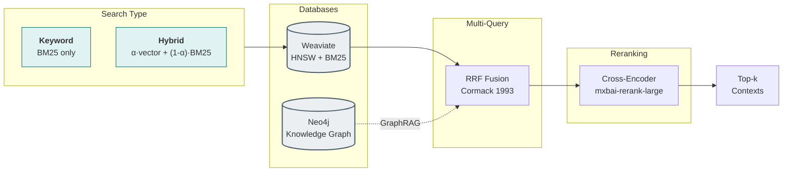

# RAGLab Documentation

Deep-dive implementation documentation for understanding how each technique works, why design decisions were made, and how components integrate.

## Getting Started

- **[Getting Started Guide](getting-started.md)** — Installation, prerequisites, full command reference
- **[Architecture](architecture.md)** — Pipeline diagram, project structure, key modules

---

## Content Preparation

How raw documents become searchable chunks.

| Stage | Doc | Summary |
|-------|-----|---------|
| [PDF Extraction](content-preparation/pdf-extraction.md) | — | Docling-based PDF to Markdown conversion *(pending)* |

---

## Two Axes of RAG Optimization

RAGLab separates RAG optimization into two independent axes, enabling systematic A/B testing:

```
4D Evaluation Grid:
  Collections × Alphas × Top-K × Strategies
       │          │        │         │
       │          │        │         └── [none, hyde, decomposition, graphrag]
       │          │        └── [10, 20] retrieval depth
       │          └── [0.0-1.0] BM25 ↔ vector balance
       └── [section, contextual, raptor]

~85-120 valid combinations evaluated with RAGAS
```

## Chunking Strategies (Index Time)

How documents are split and indexed. Each strategy creates a different collection in Weaviate.

| Strategy | Paper | Summary |
|----------|-------|---------|
| [Section Chunking](chunking/section-chunking.md) | — | Baseline: 800-token chunks with 2-sentence overlap |
| [Contextual Chunking](chunking/contextual-chunking.md) | [Anthropic](https://www.anthropic.com/news/contextual-retrieval) | LLM-generated context prepended to each chunk |
| [RAPTOR](chunking/raptor.md) | [arXiv:2401.18059](https://arxiv.org/abs/2401.18059) | Hierarchical summary tree via UMAP + GMM clustering |

## Preprocessing Strategies (Query Time)

How queries are transformed before retrieval. Applied at search time, independent of chunking.

| Strategy | Paper | Summary |
|----------|-------|---------|
| None | — | Baseline: Original query unchanged |
| [HyDE](preprocessing/hyde.md) | [arXiv:2212.10496](https://arxiv.org/abs/2212.10496) | Generate hypothetical answer for semantic matching |
| [Query Decomposition](preprocessing/query-decomposition.md) | [arXiv:2507.00355](https://arxiv.org/abs/2507.00355) | Break into sub-queries + RRF merging |
| [GraphRAG](preprocessing/graphrag.md) | [arXiv:2404.16130](https://arxiv.org/abs/2404.16130) | Entity extraction + Leiden communities + hybrid retrieval |

## Evaluation

- [RAGAS Framework](evaluation/README.md) — 5 metrics, 4D grid search, trace persistence
- [Workflow & Design Decisions](../memory-bank/evaluation-workflow.md) — Architecture diagrams, caching, retry logic

## Quick Reference

### Running Each Strategy

```bash
# Chunking (Stage 4)
python -m src.stages.run_stage_4_chunking --strategy section     # Baseline
python -m src.stages.run_stage_4_chunking --strategy contextual  # Anthropic-style
python -m src.stages.run_stage_4_5_raptor                        # RAPTOR tree

# GraphRAG (separate pipeline)
python -m src.stages.run_stage_4_5_autotune      # Discover entity types
python -m src.stages.run_stage_4_6_graph_extract # Extract entities
python -m src.stages.run_stage_6b_neo4j          # Upload to Neo4j + Leiden

# Evaluation
python -m src.stages.run_stage_7_evaluation --preprocessing hyde
python -m src.stages.run_stage_7_evaluation --comprehensive  # Full grid search
```

### Key Source Files

| Area | Files |
|------|-------|
| Chunking | `src/rag_pipeline/chunking/section_chunker.py`, `contextual_chunker.py`, `raptor/` |
| Preprocessing | `src/rag_pipeline/retrieval/preprocessing/strategies.py` |
| GraphRAG | `src/graph/extractor.py`, `community.py`, `query.py` |
| RRF Merging | `src/rag_pipeline/retrieval/rrf.py` |
| Evaluation | `src/evaluation/ragas_evaluator.py` |


#### Retrieval & Search Methods



