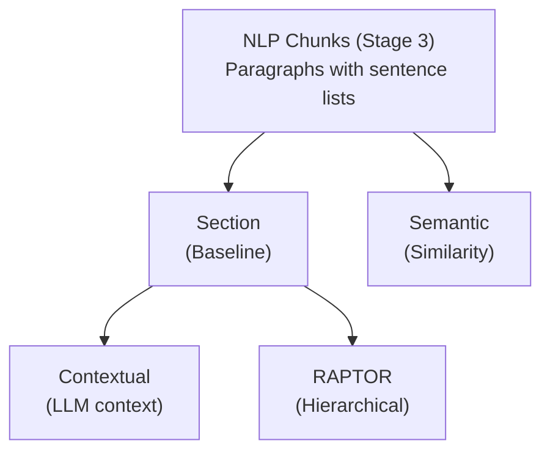

# Chunking Strategies

[← Content Preparation](../content-preparation/README.md) | [Home](../../README.md)

This project implements several chunking strategies to compare their performance and measure how each affects overall retrieval quality.

I started with basic section-based and semantic chunking, as commonly recommended, but poor results drove me to explore more advanced techniques. After researching the literature, I decided to implement RAPTOR and Contextual chunking.

The specific corpus content and the types of questions the system must answer shape key design decisions. Chunking is particularly important because it is the first stage that directly influences everything downstream.

Neuroscience and philosophy texts contain dense conceptual content and intricate knowledge relationships. When a philosopher builds an argument about consciousness over 40 pages, or a neuroscientist traces the evolutionary origins of addiction through multiple chapters, naive chunking destroys the conceptual unity that makes these texts meaningful. When relating ideas across fields, preserving complete concepts becomes even more critical.

The goal is to create chunks large enough to contain complete ideas useful for generating answers, while still allowing advanced techniques—both at chunking and query time—to connect related concepts across the corpus.


## Navigation

This document explains common and general considetations about chunking, but the details of each strategy are here:

- **[Section Chunking](section-chunking.md)** — The baseline: fixed-size with sentence overlap
- **[Semantic Chunking](semantic-chunking.md)** — Embedding-based topic boundaries
- **[Contextual Chunking](contextual-chunking.md)** — LLM-generated context prepended
- **[RAPTOR](raptor.md)** — Hierarchical summarization tree


## Why Custom Implementation

This project implements custom chunking rather than using ready-to-use frameworks like LangChain's `RecursiveCharacterTextSplitter` or LlamaIndex's `SentenceSplitter`. While these tools are convenient, building from scratch provides deeper understanding of chunking internals and enables fine-grained control—such as exact token counting, configurable sentence overlap, and tunable similarity thresholds for semantic boundaries.


## Why 800 Tokens

Research shows optimal chunk size depends heavily on content type and query complexity. [NVIDIA's chunking benchmark](https://developer.nvidia.com/blog/finding-the-best-chunking-strategy-for-accurate-ai-responses/) found 512-1024 tokens optimal for complex analytical queries, while [recent academic research](https://arxiv.org/html/2505.21700v2) confirms that larger chunks (512-1024 tokens) significantly improve retrieval for technical content—TechQA accuracy jumped from 4.8% at 64 tokens to 71.5% at 1024 tokens. Smaller chunks (64-128 tokens) only outperform for factoid queries with concise, localized answers.

For this corpus, 800 tokens preserves paragraph unity effectively. Analysis of the section chunks shows 65% of neuroscience textbook sections fit within a single 800-token chunk (averaging 1.6 chunks per section), meaning most conceptual units remain intact. Philosophy texts show higher variance—short aphoristic works like the Tao Te Ching fit 99% of sections in one chunk, while longer essays like Seneca's Letters average 3.4 chunks per section. The 800-token size balances preserving complete ideas in structured textbooks while remaining within the 512-1024 range that research identifies as optimal for analytical content requiring broader context.


## Shared Infrastructure

All chunking strategies share common components:

| Component | Implementation | Purpose |
|-----------|----------------|---------|
| **Token counting** | `tiktoken` with `text-embedding-3-large` | Exact token counts matching embedding model |
| **Embedding model** | `text-embedding-3-large` (3072 dims) | State-of-the-art dense retrieval |
| **Vector storage** | Weaviate HNSW index + BM25 | Hybrid search (dense + keyword) |
| **Chunk metadata** | `book_id`, `section`, `context` | Hierarchical path for filtering and display |

### Chunk Schema

Every chunk includes standardized metadata:

```json
{
  "chunk_id": "BookName::chunk_42",
  "book_id": "BookName",
  "context": "BookName > Chapter 3 > Section 2",
  "section": "Section 2",
  "text": "The actual chunk content...",
  "token_count": 750,
  "chunking_strategy": "section"
}
```

The `context` field preserves hierarchical position (Book > Chapter > Section), enabling:
- Scoped retrieval ("only search Chapter 5")
- Answer attribution ("This is from Chapter 3, Section 2")
- Cross-reference tracking


### Strategy Dependencies



Both **Contextual** and **RAPTOR** are post-processing steps that build on Section chunks.

---

## Running Chunking

```bash
# Section (baseline) - No dependencies
python -m src.stages.run_stage_4_chunking --strategy section

# Semantic - No dependencies, specify threshold
python -m src.stages.run_stage_4_chunking --strategy semantic --threshold 0.4

# Contextual - Requires section chunks first
python -m src.stages.run_stage_4_chunking --strategy contextual

# RAPTOR - Requires section chunks first (Stage 4.5)
python -m src.stages.run_stage_4_5_raptor
```

This stage reads json files (one per book) from `data/processed/04_nlp_chunks/` and storage chunks in json on `data/processed/04_nlp_chunks/` ,one folder per strategy. It is stored in files to isolate each phase and to visualize the results before embedding phase.


| Strategy | Output Directory |
|----------|------------------|
| Section | `data/processed/05_final_chunks/section/` |
| Semantic | `data/processed/05_final_chunks/semantic_0.4/` |
| Contextual | `data/processed/05_final_chunks/contextual/` |
| RAPTOR | `data/processed/05_final_chunks/raptor/` |

---


## Key Code Files

| File | Purpose |
|------|---------|
| `src/rag_pipeline/chunking/section_chunker.py` | Section-based chunking with overlap |
| `src/rag_pipeline/chunking/semantic_chunker.py` | Embedding similarity boundaries |
| `src/rag_pipeline/chunking/contextual_chunker.py` | LLM context generation |
| `src/rag_pipeline/chunking/raptor/tree_builder.py` | RAPTOR tree construction |
| `src/rag_pipeline/chunking/strategies.py` | Strategy registry and CLI routing |
| `src/config.py` | Chunking parameters (MAX_CHUNK_TOKENS, thresholds) |

---


### Related

- [Preprocessing Strategies](../preprocessing/README.md) — Query-time transformations
- [Evaluation Framework](../evaluation/README.md) — How strategies are compared
