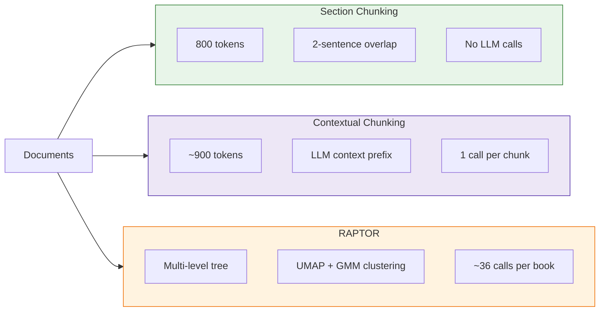

# Chunking Strategies

Chunking determines how documents are split before embedding and indexing. This is an **index-time decision** — changing chunking strategy requires re-processing the entire corpus.

---

## Strategy Overview



---

## Strategy Comparison

| Strategy | Paper | Tokens/Chunk | LLM Calls | Best For |
|----------|-------|--------------|-----------|----------|
| [**Section**](section-chunking.md) | — | ~800 | 0 | Baseline, fast iteration, cost-sensitive |
| [**Contextual**](contextual-chunking.md) | [Anthropic](https://www.anthropic.com/news/contextual-retrieval) | ~900 | 1/chunk | Best answer correctness, production |
| [**RAPTOR**](raptor.md) | [arXiv:2401.18059](https://arxiv.org/abs/2401.18059) | Variable | ~36/book | Theme questions, faithfulness |

---

## Performance Summary

From comprehensive evaluation across 102 configurations:

| Metric | Section | Contextual | RAPTOR |
|--------|---------|------------|--------|
| **Single-Concept Correctness** | 57.6% | **59.1%** | 57.9% |
| **Cross-Domain Correctness** | 47.9% | **48.8%** | 48.4% |
| **Faithfulness** | 95.0% | 93.9% | **95.2%** |
| **Recall Drop (simple→complex)** | -16.6% | -16.8% | -19.7% |

**Key Insights:**
1. **Contextual** achieves best answer correctness (+2.6% over baseline)
2. **RAPTOR** achieves best faithfulness (95.2%) — less hallucination
3. **Section** shows most consistent performance across query types

---

## Trade-offs

### Section Chunking
- **Pros**: Zero cost, fast indexing, predictable chunks, most consistent
- **Cons**: Loses document-level context in embeddings
- **Use when**: Iterating quickly, cost-sensitive, simple queries

### Contextual Chunking
- **Pros**: +35% fewer retrieval failures (Anthropic), best correctness
- **Cons**: LLM cost per chunk (~$2-3 for 5K chunks), longer indexing
- **Use when**: Production deployments, ambiguous content

### RAPTOR
- **Pros**: Best faithfulness, answers theme questions, multi-level abstraction
- **Cons**: Complex pipeline, many LLM calls, larger index
- **Use when**: "What is this book about?", faithfulness-critical domains

---

## Shared Infrastructure

All chunking strategies share:

| Component | Implementation |
|-----------|----------------|
| **Token counting** | `tiktoken` with `text-embedding-3-large` tokenizer |
| **Embedding model** | `text-embedding-3-large` (1536 dimensions) |
| **Vector storage** | Weaviate HNSW index + BM25 hybrid search |
| **Chunk metadata** | `book_id`, `section`, `context` (hierarchical path) |

---

## Running Chunking

```bash
# Section (baseline)
python -m src.stages.run_stage_4_chunking --strategy section

# Contextual (requires section chunks first)
python -m src.stages.run_stage_4_chunking --strategy contextual

# RAPTOR (separate pipeline)
python -m src.stages.run_stage_4_5_raptor
```

Each strategy outputs to `data/processed/05_final_chunks/{strategy}/`.

---

## Selection Guide

```
Start here:
    │
    ├── Need fast iteration? ──────────────► Section
    │
    ├── Production deployment?
    │       │
    │       ├── General Q&A ───────────────► Contextual
    │       │
    │       └── Faithfulness critical? ────► RAPTOR
    │
    └── Theme/synthesis questions? ────────► RAPTOR + GraphRAG
```

---

## Related

- [Preprocessing Strategies](../preprocessing/README.md) — Query-time transformations
- [Evaluation Framework](../evaluation/README.md) — How strategies are compared
