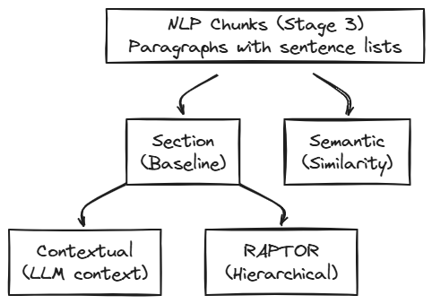

# Chunking Strategies

[← Content Preparation](../content-preparation/README.md) | [Home](../../README.md)

This project implements several chunking strategies to compare their performance and measure how each affects overall retrieval quality.

I started with basic section-based and semantic chunking, as commonly recommended, but poor results drove me to explore more advanced techniques. After researching the literature, I decided to implement RAPTOR and Contextual chunking.

The specific corpus content and the types of questions the system must answer shape key design decisions. Chunking is particularly important because it is the first stage that directly influences everything downstream.

Neuroscience and philosophy texts contain dense conceptual content and intricate knowledge relationships. When a philosopher builds an argument about consciousness over 40 pages, or a neuroscientist traces the evolutionary origins of addiction through multiple chapters, naive chunking destroys the conceptual unity that makes these texts meaningful. When relating ideas across fields, preserving complete concepts becomes even more critical.

The goal is to create chunks large enough to contain complete ideas useful for generating answers, while still allowing advanced techniques—both at chunking and query time—to connect related concepts across the corpus.


## Navigation

This document explains common and general considerations about chunking, but the details of each strategy are here:

- **[Section Chunking](section-chunking.md)** — The baseline: fixed-size with sentence overlap
- **[Semantic Chunking](semantic-chunking.md)** — Embedding-based topic boundaries
- **[Contextual Chunking](contextual-chunking.md)** — LLM-generated context prepended
- **[RAPTOR](raptor.md)** — Hierarchical summarization tree


## Dependencies

It is important to note that advanced chunking strategies RAPTOR and Contextual are based on Baseline (section chunks). So decisions in section-based chunking, like max chunk size, condition the advanced techniques results.

<div align="center">
    
</div>


## Why Custom Implementation

This project implements custom chunking rather than using ready-to-use frameworks like LangChain's `RecursiveCharacterTextSplitter` or LlamaIndex's `SentenceSplitter`. While these tools are convenient, building from scratch provides deeper understanding of chunking internals and enables fine-grained control—such as exact token counting, configurable sentence overlap, and tunable similarity thresholds for semantic boundaries.

## Shared Infrastructure

All chunking strategies share common components:

| Component | Implementation | Purpose |
|-----------|----------------|---------|
| **Token counting** | `tiktoken` with `text-embedding-3-large` | Exact token counts matching embedding model |
| **Embedding model** | `text-embedding-3-large` (3072 dims) | State-of-the-art dense retrieval |
| **Vector storage** | Weaviate HNSW index + BM25 | Hybrid search (dense + keyword) |
| **Chunk metadata** | `book_id`, `section`, `context` | Hierarchical path for filtering and display |

We count tokens rather than characters because embedding models operate on tokens, and the character-to-token ratio varies with content (technical terms, punctuation, and rare words tokenize differently than common prose). Using `tiktoken` with the same encoding as `text-embedding-3-large` ensures our max-token target accurately reflects what the model will see.


### Chunk Schema

Chunks are stored in JSON files for inspection and inter-phase isolation, and every chunk includes standardized metadata:

```json
{
  "chunk_id": "BookName::chunk_42",
  "book_id": "BookName",
  "context": "BookName > Chapter 3 > Section 2",
  "section": "Section 2",
  "text": "The actual chunk content...",
  "token_count": 750,
  "chunking_strategy": "section"
}
```

These fields serve three main purposes: **attribution** (display sources in UI and answers), **filtering** (scope searches to specific books), and **advanced chunking** (RAPTOR and Contextual use them in LLM prompts to build hierarchical context). Preprocessing strategies operate on query text only and do not use chunk metadata.


## Running Chunking

Once NLP chunks are ready, you can run: 

```bash
# Section (baseline) - No dependencies
python -m src.stages.run_stage_4_chunking --strategy section

# Semantic - No dependencies, specify threshold
python -m src.stages.run_stage_4_chunking --strategy semantic --threshold 0.4

# Contextual - Requires section chunks first
python -m src.stages.run_stage_4_chunking --strategy contextual

# RAPTOR - Requires section chunks first (Stage 4.5)
python -m src.stages.run_stage_4_5_raptor
```

This stage reads JSON files (one per book) from `data/processed/04_nlp_chunks/` and stores chunks in JSON in `data/processed/05_final_chunks/`, one folder per strategy. 


| Strategy | Output Directory |
|----------|------------------|
| Section | `data/processed/05_final_chunks/section/` |
| Semantic | `data/processed/05_final_chunks/semantic_0.4/` |
| Contextual | `data/processed/05_final_chunks/contextual/` |
| RAPTOR | `data/processed/05_final_chunks/raptor/` |


---

## Navigation

**Next:** [Section Chunking](section-chunking.md) — The baseline: fixed-size with sentence overlap

**Related:**
- [Preprocessing Strategies](../preprocessing/README.md) — Query-time transformations
- [Evaluation Framework](../evaluation/README.md) — How strategies are compared
