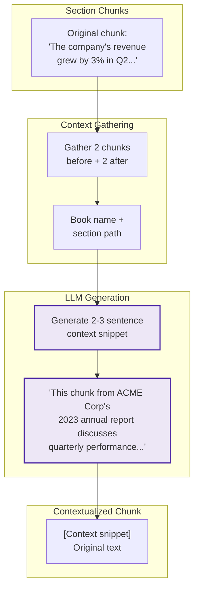

# Contextual Chunking

[← Semantic Chunking](semantic-chunking.md) | [Home](../../README.md)

> **Source:** [Anthropic Blog: Contextual Retrieval](https://www.anthropic.com/news/contextual-retrieval) | September 2024

Prepends LLM-generated context to each chunk, improving embedding quality by disambiguating entities and situating content within the document.

**Type:** Index-time chunking | **LLM Calls:** 1 per chunk | **Tokens/Chunk:** ~900

---

## Diagram



---

## Theory

### The Core Problem

Traditional chunking loses document-level context that's critical for accurate retrieval:

```
Original chunk:
"The company's revenue grew by 3% in Q2, driven primarily by
expansion into Asian markets."

Problem: Which company? What year? What's the overall trend?
```

When embedded, this chunk is semantically similar to ANY revenue growth discussion, making precise retrieval difficult when the user asks about a specific company.

### Research Background

Anthropic's September 2024 research quantified this problem:

| Approach | Retrieval Failure Rate | Improvement |
|----------|----------------------|-------------|
| Standard chunking | Baseline | - |
| Contextual chunking | **-35%** | Top-20 retrieval |
| + BM25 hybrid + reranking | **-67%** | Combined approach |

**Key insight from Anthropic:** The embedding model encodes *what words are in the chunk* but not *what the chunk is about*. Adding a contextual snippet that explicitly states the chunk's semantic role bridges this gap.

### The Transformation

```
Before: "The company's revenue grew by 3% in Q2..."
         ↓ embedding
         [vector similar to any revenue discussion]

After:  "[This chunk from ACME Corp's 2023 annual report,
         specifically the Financial Performance section
         discussing quarterly results.]
         The company's revenue grew by 3% in Q2..."
         ↓ embedding
         [vector captures: ACME, 2023, Q2, financial context]
```

---

## Implementation in RAGLab

### Algorithm

```
For each chunk in document:
  1. Gather neighboring chunks (2 before + 2 after)
  2. Build context from: book_name, section_path, neighbors
  3. Call LLM: "Generate 2-3 sentences situating this chunk"
  4. Prepend snippet: "[{snippet}] {original_text}"
  5. Re-compute token count
```

### Key Design Decisions

| Decision | Value | Rationale |
|----------|-------|-----------|
| **Neighbor count** | 2 each direction | Captures local context without excessive tokens |
| **Temperature** | 0.3 | Low for factual accuracy, high enough to vary phrasing |
| **Max snippet tokens** | 100 | Brief context, not a summary |
| **Store original_text** | Yes | Enables debugging and reprocessing |

### Differences from Anthropic's Approach

1. **Neighbor-based context**: We use 2 chunks before/after instead of full document context (token efficiency)
2. **Section path metadata**: Include hierarchical path like "Book > Chapter > Section" in prompt
3. **Dual storage**: Keep both original and contextualized text for comparison

### Context Gathering

```python
# src/rag_pipeline/chunking/contextual_chunker.py

def gather_document_context(
    chunks: List[Dict],
    current_index: int,
    neighbor_count: int = 2,
    max_context_tokens: int = 2000,
) -> str:
    """Gather text from neighboring chunks as document context."""
    start_idx = max(0, current_index - neighbor_count)
    end_idx = min(len(chunks), current_index + neighbor_count + 1)

    context_parts = []
    for i in range(start_idx, end_idx):
        if i != current_index:
            chunk_text = chunks[i].get("text", "")
            section = chunks[i].get("section", "")
            if chunk_text:
                if section:
                    context_parts.append(f"[{section}] {chunk_text}")
                else:
                    context_parts.append(chunk_text)

    return "\n\n".join(context_parts)
```

### Snippet Generation

```python
def generate_contextual_snippet(
    chunk: Dict,
    document_context: str,
    model: str = "openai/gpt-4o-mini",
    max_tokens: int = 100,
) -> str:
    """Generate a contextual snippet for a chunk using LLM."""
    prompt = CONTEXTUAL_PROMPT.format(
        document_context=document_context,
        chunk_text=chunk.get("text", ""),
        book_name=chunk.get("book_id", "Unknown"),
        context_path=chunk.get("context", ""),
    )

    return call_chat_completion(
        messages=[{"role": "user", "content": prompt}],
        model=model,
        temperature=0.3,
        max_tokens=max_tokens,
    ).strip()
```

---

## Performance in This Pipeline

### Key Finding: Best Answer Correctness Across Query Types

From comprehensive evaluation across 102 configurations:

| Metric | Contextual | Section | RAPTOR | Semantic 0.3 |
|--------|------------|---------|--------|--------------|
| Single-Concept Correctness | **59.1%** | 57.6% | 57.9% | 54.1% |
| Cross-Domain Correctness | **48.8%** | 47.9% | 48.4% | 48.0% |
| Single-Concept Recall | **96.3%** | 92.9% | 96.1% | 93.3% |

**Primary Takeaway:** Contextual chunking achieves the **highest answer correctness** on both single-concept and cross-domain queries. The LLM-generated context helps the embedding model understand what each chunk IS ABOUT, not just what words it contains.

### Why Recall Correlates with Correctness

The evaluation revealed a critical insight: **recall matters more than precision for answer quality**.

| Strategy | Precision | Recall | Answer Correctness |
|----------|-----------|--------|-------------------|
| Semantic 0.3 | **73.4%** (1st) | 93.3% | 54.1% (4th) |
| Contextual | 71.7% (2nd) | **96.3%** (1st) | **59.1%** (1st) |

The generator LLM can filter irrelevant context (low precision is recoverable) but cannot invent missing information (low recall is unrecoverable).

### Synergy with GraphRAG

Contextual + GraphRAG achieves the highest answer correctness (61.7% single-concept) because they operate on orthogonal dimensions:
- **Contextual**: Intra-document clarity (what is this chunk about?)
- **GraphRAG**: Inter-document connections (how do concepts relate?)

---

## Cost Analysis

For 19 books with ~5,000 total chunks:
- **Model**: `gpt-4o-mini` (~$0.15/1M input, ~$0.60/1M output)
- **Input**: ~2000 tokens/call (context + prompt)
- **Output**: ~80 tokens/call (snippet)
- **Total cost**: ~$2-3 for full corpus
- **Indexing time**: ~2-3 hours (rate-limited by API calls)

---

## When to Use

| Scenario | Recommendation |
|----------|----------------|
| Production deployments | Use contextual for best answer quality |
| Ambiguous content | Pronouns, partial references need disambiguation |
| Multi-document corpora | Distinguish "the company" across different sources |
| Hybrid search | BM25 benefits from added keywords in context |
| **Avoid when** | Cost-sensitive prototyping, frequently changing corpus |

---

## Navigation

**Next:** [RAPTOR](raptor.md) — Hierarchical summarization tree

**Related:**
- [Section Chunking](section-chunking.md) — Prerequisite (contextual builds on section chunks)
- [Semantic Chunking](semantic-chunking.md) — Embedding-based boundaries alternative
- [Chunking Overview](README.md) — Strategy comparison
