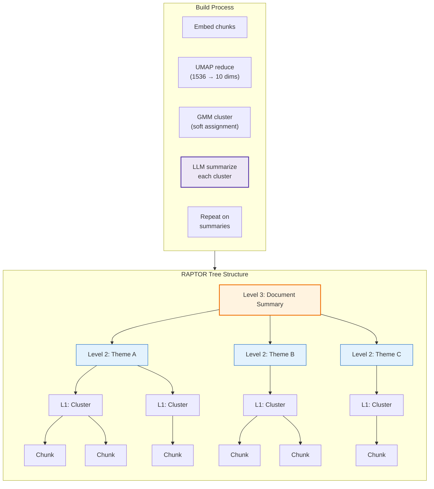

# RAPTOR: Hierarchical Summarization Tree

[← Contextual Chunking](contextual-chunking.md) | [Home](../../README.md)

> **Paper:** [RAPTOR: Recursive Abstractive Processing for Tree-Organized Retrieval](https://arxiv.org/abs/2401.18059) | Sarthi et al. (Stanford/Google) | ICLR 2024

Builds a hierarchical tree of summaries from document chunks, enabling retrieval at multiple levels of abstraction. Answers both "What did Sapolsky say about cortisol?" and "What is the main argument of this book?"

**Type:** Index-time chunking | **LLM Calls:** ~36 per book | **Output:** Multi-level tree

---

## Diagram



---

## Theory

### The Core Problem

Traditional RAG retrieves only leaf-level chunks. This fails for questions requiring multi-document synthesis:

- **Theme questions**: "What is the author's central argument?"
- **Multi-section synthesis**: "How do chapters 3 and 7 connect?"
- **Comparative questions**: "What's the difference between X and Y approaches?"

No single chunk contains these answers because they span many chunks scattered across the document.

### Research Background

RAPTOR (ICLR 2024) addresses this with hierarchical summarization:

| Benchmark | RAPTOR | Best Baseline | Improvement |
|-----------|--------|---------------|-------------|
| QuALITY (multi-step reasoning) | 82.6% | 62.7% | **+20% absolute** |
| QASPER (scientific QA) | 55.7% F1 | 53.0% (DPR) | **New SOTA** |

**Key finding:** 18.5-57% of retrieved nodes come from summary layers, proving that hierarchical abstraction provides information not available in leaves alone.

### The Algorithm

1. **Cluster semantically similar chunks** using UMAP dimensionality reduction + Gaussian Mixture Models (GMM)
2. **Generate LLM summaries** for each cluster
3. **Recursively repeat** on the summaries until tree can't grow
4. **Collapsed tree retrieval**: Query all nodes (leaves + summaries) together; similarity naturally selects appropriate abstraction level

### Why GMM Over K-means?

GMM provides **soft clustering**: a chunk about "stress and cortisol" can belong to BOTH "neuroscience" AND "health effects" clusters. K-means forces hard assignment.

---

## Implementation in RAGLab

### Algorithm

```
For each book:
  1. Load section chunks as level-0 nodes (leaves)
  2. Embed all nodes

  While nodes.count > MIN_CLUSTER_SIZE:
    3. UMAP: Reduce embedding dimensions (1536 → 10)
    4. GMM: Find optimal K clusters using BIC
    5. GMM: Soft-cluster nodes (allows multi-cluster membership)
    6. For each cluster:
       - Concatenate member texts
       - Generate LLM summary
       - Create new node at level+1
    7. Embed new summary nodes
    8. Repeat with summary nodes as input

  Return all nodes (leaves + all summary levels)
```

### Key Design Decisions

| Decision | Paper | RAGLab | Rationale |
|----------|-------|--------|-----------|
| **Leaf chunk size** | 100 tokens | 800 tokens | See [Chunk Size Analysis](#chunk-size-analysis) below |
| **Summary model** | gpt-3.5-turbo | claude-3-haiku | Fast, cheap, sufficient quality |
| **UMAP n_neighbors** | 10 | 10 | Paper default works well |
| **UMAP n_components** | 10 | 10 | Standard for GMM input |
| **Retrieval method** | Collapsed tree | Collapsed tree | Paper shows superiority over tree traversal |
| **Tree scope** | Per-document | Per-book | Matches existing structure |

### Differences from Paper

1. **Larger leaves**: 800-token section chunks vs 100-token chunks (reduces tree depth)
2. **Per-book trees**: Paper sometimes builds cross-document trees; we stay within books
3. **Hard clustering default**: We use hard cluster assignment initially (Option A in research); soft clustering (Option C with P > 0.3 threshold) is future work

### Chunk Size Analysis

The most significant deviation from the paper is using 800-token leaves instead of 100-token leaves. This section explains why both choices make sense for their respective contexts.

#### What the Paper Says (and Doesn't Say)

The RAPTOR paper is surprisingly brief on chunk size rationale:

> "We split the retrieval corpus into short, contiguous texts of length 100, similar to traditional retrieval augmentation techniques."

No ablation study on chunk size was conducted. The authors' ablation compared **clustering methods** (semantic vs contiguous grouping), not chunk sizes. The 100-token choice appears inherited from prior RAG conventions rather than corpus-specific optimization.

#### The Paper's Evaluation Datasets

| Dataset | Content Type | Nature |
|---------|--------------|--------|
| **NarrativeQA** | Books, movie transcripts | Narrative fiction, flowing prose |
| **QASPER** | NLP research papers | Technical, well-structured sections |
| **QuALITY** | Magazine articles (~5k tokens) | Mixed, medium-length |

These datasets are heterogeneous. The 100-token size may have been a **lowest common denominator** that works acceptably across narrative fiction, academic papers, and magazine prose.

#### Why Small Chunks Serve RAPTOR's Goals

The implicit design philosophy behind 100-token chunks:

1. **More granular clustering**: 100 leaves per 10k-token document enables fine-grained semantic groupings
2. **Deeper trees**: More leaves → more clusters → more summary levels (3-4 typical)
3. **Richer hierarchy**: Each level captures a different abstraction granularity

RAPTOR's power comes from having **many hierarchical levels**. Small chunks are the mechanism that enables deep trees.

#### Why 800 Tokens for This Corpus

RAGLab's corpus differs fundamentally from RAPTOR's evaluation datasets:

| Corpus | Content | Avg Section | Characteristic |
|--------|---------|-------------|----------------|
| **Neuroscience** | Textbooks (Sapolsky, Huberman) | 666 tokens | Dense terminology, structured arguments |
| **Philosophy** | Treatises (Seneca, Schopenhauer) | 1,427 tokens | Extended reasoning, conceptual development |

[Research on long-document retrieval](https://arxiv.org/html/2505.21700v2) shows content type strongly affects optimal chunk size:

- **Factoid queries** (concise answers): Small chunks (64-128 tokens) optimal
- **Technical content** (TechQA): Accuracy jumped from 4.8% → 71.5% when moving from 64 to 1024 tokens
- **Narrative requiring context** (NarrativeQA): Performance improved 4.2% → 10.7% (64 → 1024 tokens)

Dense academic content—like neuroscience and philosophy—needs larger chunks to preserve the contextual scaffolding that makes arguments coherent. A 100-token chunk from Schopenhauer might capture half a sentence of a complex syllogism, losing the logical structure entirely.

#### The Trade-off

| Aspect | 100-token (Paper) | 800-token (RAGLab) |
|--------|-------------------|-------------------|
| **Tree depth** | Deep (3-4 levels) | 2-3 levels (see below) |
| **Clustering granularity** | Fine-grained | Coarser |
| **Leaf retrieval quality** | Less context per hit | More complete ideas |
| **Summary coverage** | Narrow focus | Broader themes |

#### Actual Tree Depths in This Corpus

Analysis of the 19 books in this corpus shows tree depth correlates with document size:

| Category | Books | Leaves | Summary Levels | Example |
|----------|-------|--------|----------------|---------|
| **Large textbooks** | 5 | 500-880 | 3 (L1→L2→L3) | Cognitive Neuroscience: 881→38→7→3 |
| **Medium books** | 6 | 250-500 | 2 (L1→L2) | Letters from a Stoic: 416→21→4 |
| **Short works** | 8 | 70-160 | 2 (L1→L2) | Tao Te Ching: 129→14→3 |

With 100-token chunks, a book like *Cognitive Neuroscience* would have ~7,000 leaves instead of 881, enabling 4-5 summary levels. The trade-off: deeper hierarchy vs. fragmented leaf content.

#### The Key Question

Does RAPTOR's benefit come from:
- **(A) The tree structure itself** — summaries bridging distant content, or
- **(B) Small chunk granularity** — enabling fine-grained clustering?

If (A), RAGLab's approach preserves the core benefit: hierarchical summaries still exist and still bridge content across sections. If (B), some clustering precision is lost.

**Our assessment:** For dense academic content, (A) matters more. The hierarchical summaries provide value regardless of leaf size, while larger leaves better preserve the conceptual unity that defines philosophical and scientific argumentation. The evaluation results support this—RAPTOR achieves best faithfulness (95.2%) even with 800-token leaves.

### UMAP Dimensionality Reduction

```python
# src/rag_pipeline/chunking/raptor/clustering.py

from umap import UMAP

def reduce_dimensions(embeddings: np.ndarray) -> np.ndarray:
    """Reduce high-dim embeddings for GMM clustering."""
    reducer = UMAP(
        n_neighbors=10,      # Balance local/global structure
        n_components=10,     # Target dimensions for GMM
        min_dist=0.0,        # Tight clusters
        metric='cosine'      # Match embedding similarity
    )
    return reducer.fit_transform(embeddings)
```

**Why UMAP?** GMM struggles with high dimensions (curse of dimensionality). UMAP preserves both local and global structure while reducing 1536 dims to 10.

### GMM Clustering with BIC

```python
from sklearn.mixture import GaussianMixture

def find_optimal_clusters(embeddings: np.ndarray, max_k: int = 50) -> int:
    """Find optimal K using Bayesian Information Criterion."""
    bics = []
    for k in range(2, max_k + 1):
        gmm = GaussianMixture(n_components=k, random_state=42)
        gmm.fit(embeddings)
        bics.append(gmm.bic(embeddings))
    return np.argmin(bics) + 2  # Lower BIC is better
```

BIC automatically determines cluster count based on data, avoiding magic numbers.

### LLM Summarization

```python
# src/rag_pipeline/chunking/raptor/summarizer.py

RAPTOR_SUMMARY_PROMPT = """Write a comprehensive summary of the following passages.
Include key details, names, and specific concepts.

Passages:
{context}

Summary:"""

def generate_cluster_summary(chunks: List[Dict], model: str) -> str:
    context = "\n\n".join(chunk["text"] for chunk in chunks)
    return call_chat_completion(
        messages=[{"role": "user", "content": prompt}],
        model=model,
        temperature=0.3,
        max_tokens=200
    )
```

Average summary: 131 tokens (~72% compression). Average children per parent: 6.7 chunks.

---

## Performance in This Pipeline

### Key Finding: Best Faithfulness Score

From comprehensive evaluation across 102 configurations:

| Metric | RAPTOR | Contextual | Section |
|--------|--------|------------|---------|
| Faithfulness | **95.2%** (1st) | 93.9% | 95.0% |
| Cross-Domain Precision | **93.8%** (1st) | 91.9% | 92.7% |
| Answer Correctness | 48.4% | **48.8%** | 47.9% |

**Primary Takeaway:** RAPTOR achieves the **highest faithfulness** (95.2%), meaning answers are more grounded in the retrieved context with less hallucination. The hierarchical summaries provide verified thematic anchors that reduce fabrication.

### Why RAPTOR Excels at Faithfulness

The summary nodes are **pre-computed verified abstractions**. When the LLM generates an answer, it can cite summary nodes that have already distilled and validated thematic claims, rather than synthesizing from scratch.

### Trade-off: Complexity vs Marginal Gains

RAPTOR's answer correctness (48.4%) is close to Contextual (48.8%) but requires significantly more infrastructure:
- ~36 LLM calls per book for summarization
- UMAP + GMM clustering pipeline
- Larger index (leaves + summaries)

**Recommendation:** Use RAPTOR when faithfulness is critical (e.g., regulated domains, low-hallucination requirements). Use Contextual for general-purpose answer quality with simpler infrastructure.

---

## Cost Analysis

For 19 books with ~150 chunks each:
- **Summaries**: ~36 per book (level 1: ~30, level 2: ~5, root: ~1)
- **LLM calls**: 36 × 19 = ~684 calls
- **Cost**: ~$0.40 total (claude-3-haiku at $0.25/$1.25 per 1M tokens)
- **Time**: ~3 minutes per book (LLM-dominated)
- **Index size**: ~23% larger than section-only (leaves + summaries)

---

## When to Use

| Scenario | Recommendation |
|----------|----------------|
| Theme/argument questions | RAPTOR excels at "What is this book about?" |
| Low-hallucination requirements | Best faithfulness scores |
| Multi-section synthesis | Summaries bridge distant content |
| **Avoid when** | Simple factual queries, cost-sensitive, frequently changing corpus |

---

## Running RAPTOR

```bash
# Build RAPTOR trees (Stage 4.5)
python -m src.stages.run_stage_4_5_raptor

# Embed trees (Stage 5)
python -m src.stages.run_stage_5_embedding --strategy raptor

# Upload to Weaviate (Stage 6)
python -m src.stages.run_stage_6_weaviate --strategy raptor

# Evaluate
python -m src.stages.run_stage_7_evaluation --collection RAG_raptor_embed3large_v1
```

---

## Navigation

**Next:** [Query-Time Strategies](../preprocessing/README.md) — How queries are transformed

**Related:**
- [Section Chunking](section-chunking.md) — Prerequisite (RAPTOR uses section chunks as leaves)
- [Semantic Chunking](semantic-chunking.md) — Embedding-based boundaries alternative
- [Contextual Chunking](contextual-chunking.md) — Alternative approach (can be combined)
- [GraphRAG](../preprocessing/graphrag.md) — Different hierarchy via knowledge graphs
- [Chunking Overview](README.md) — Strategy comparison
