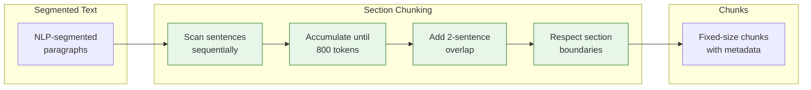

# Section Chunking (Baseline)

[← Chunking Overview](README.md) | [Home](../../README.md)

The baseline chunking strategy. Splits documents into fixed-size chunks while respecting section boundaries and maintaining sentence overlap for context continuity.

**Type:** Index-time chunking | **LLM Calls:** 0 | **Tokens/Chunk:** ~800

---

## Diagram



---

## Theory

### The Core Problem

Naive chunking (splitting every N tokens) creates semantic fragmentation:

1. **Mid-sentence splits**: "The prefrontal cortex regulates" / "emotional responses through..." breaks a complete thought
2. **Context orphaning**: A chunk mentioning "the study" loses reference to which study
3. **Boundary violations**: Mixing a chapter's conclusion with the next chapter's introduction

### Research Background

Fixed-size chunking with overlap is the baseline approach in most RAG systems. While no single paper defines it, the technique emerges from information retrieval principles:

- **Passage retrieval** (Robertson & Zaragoza, 2009): Documents are too coarse; sentences too fine
- **Sliding window**: Overlap prevents boundary artifacts (standard in NLP preprocessing)
- **Token limits**: LLM context windows require bounded chunk sizes

The key insight: chunks should be **semantically coherent units** that fit within embedding model sweet spots (typically 256-1024 tokens for modern models).

---

## Implementation in RAGLab

### Algorithm

```
For each document:
  1. Load NLP-segmented paragraphs (spaCy sentence boundaries)
  2. Initialize: current_chunk = [], current_context = None

  For each paragraph:
    If context changed (new section):
      Save current_chunk
      Start new chunk (no overlap across sections)

    For each sentence:
      If (current_chunk + sentence) <= MAX_TOKENS:
        Append sentence to chunk
      Else:
        Save current_chunk
        Start new chunk with last 2 sentences (overlap)
```

### Key Design Decisions

| Decision | Value | Rationale |
|----------|-------|-----------|
| **Chunk size** | 800 tokens (max) | Upper limit balancing paragraph unity and retrieval performance |
| **Overlap** | 2 sentences | Handles "As mentioned above..." references with minimal redundancy (~50-100 tokens) |
| **Section boundaries** | Hard break | Prevents mixing unrelated content; preserves author's semantic organization |
| **Tokenizer** | tiktoken (text-embedding-3-large) | Exact token count matching embedding model |

### Chunk size: 800 Tokens limit

Research shows optimal chunk size depends on content type and query complexity. [NVIDIA's chunking benchmark](https://developer.nvidia.com/blog/finding-the-best-chunking-strategy-for-accurate-ai-responses/) tested sizes from 128 to 2,048 tokens and found 512-1024 tokens optimal for complex analytical queries, while page-level chunking achieved the highest overall accuracy (0.648). [Academic research on long-document retrieval](https://arxiv.org/html/2505.21700v2) confirms this pattern: smaller chunks (64-128 tokens) work best for factoid queries with concise answers, but larger chunks (512-1024 tokens) significantly improve retrieval for technical content—TechQA accuracy jumped from 4.8% at 64 tokens to 71.5% at 1024 tokens. For content requiring broader contextual understanding like NarrativeQA, performance improved from 4.2% to 10.7% as chunk size increased from 64 to 1024 tokens.

Analysis of this corpus reveals distinct patterns between content types:

| Corpus | Avg Section Tokens | Median | Fit in 800 tokens? |
|--------|-------------------|--------|-------------------|
| **Neuroscience** | 666 | ~500-700 | Yes, 0.8x chunk size |
| **Philosophy** | 1,427 | varies widely | No, 1.8x chunk size |

Neuroscience textbooks have well-structured sections averaging 666 tokens—comfortably below the 800-token limit, meaning most conceptual units remain intact within single chunks. Philosophy texts show much higher variance:
- **Aphoristic works** (Tao Te Ching: 159 avg, Art of Living: 238 avg) — fit easily in single chunks
- **Essay collections** (Seneca's Letters: 2,127 avg, Schopenhauer: 2,300+ avg) — require multiple chunks
- **Outliers**: Marcus Aurelius's Meditations has one section of 60,898 tokens

The 800-token limit represents a balanced estimate for this mixed corpus. It falls within the 512-1024 range that research identifies as optimal for technical and analytical content, while preserving most neuroscience textbook sections as complete units. For philosophy essays that exceed this limit, the 2-sentence overlap helps maintain some continuity, though advanced techniques like Contextual Chunking or RAPTOR may provide better results for such content. 

This is an upper limit, not a target—actual chunks are often smaller when sections end naturally. The value could be tuned per content type: shorter limits for factoid-heavy reference works, longer for essay-style texts requiring extended context. Semantic chunking also enforces this 800-token maximum to prevent oversized segments regardless of similarity scores.

### Differences from Standard Approaches

1. **Section-aware breaks**: Unlike pure sliding window, we never cross section boundaries
2. **Sentence-level accumulation**: Add complete sentences, not raw tokens
3. **Oversized sentence handling**: Academic text sometimes has 800+ token sentences; we split by punctuation marks (`;`, `:`, `,`) before falling back to word boundaries

### Core Function

```python
# src/rag_pipeline/chunking/section_chunker.py

def create_chunks_from_paragraphs(
    paragraphs: List[Dict],
    book_name: str,
    max_tokens: int = 800,
    overlap_sentences: int = 2
) -> List[Dict]:
```

Each chunk includes metadata: `chunk_id`, `book_id`, `context` (hierarchical path like "Book > Chapter > Section"), `section`, `text`, `token_count`.

---

## Performance in This Pipeline

### Key Finding: Section Chunking Provides Best Consistency

From comprehensive evaluation across 102 configurations:

| Metric | Section Chunking | Contextual | RAPTOR |
|--------|------------------|------------|--------|
| Single-Concept Relevancy | **89.1%** (1st) | 85.5% | 81.5% |
| Cross-Domain Recall Drop | **-16.6%** (best) | -16.8% | -19.7% |

**Takeaway:** Section chunking shows the **smallest degradation** when moving from simple to complex queries (-16.6% recall drop vs -30.5% for semantic chunking). The author's section organization provides natural semantic boundaries that remain robust across query types.

### Limitations

- **No document-level context in embeddings**: "The company" doesn't know which company
- **Struggles with cross-section references**: "As Chapter 3 explained..." loses connection
- **Vocabulary mismatch**: Embedding reflects chunk words, not chunk meaning

These limitations motivate Contextual Chunking (adds LLM context) and RAPTOR (hierarchical summaries).

---

## When to Use

| Scenario | Recommendation |
|----------|----------------|
| Initial development | Use section chunking for fast iteration |
| Cost-sensitive deployment | Zero LLM calls at index time |
| Well-structured documents | Sections provide natural semantic units |
| Specific fact retrieval | "What did Sapolsky say about cortisol?" |
| **Avoid when** | Ambiguous content, cross-document synthesis needed |

---

## Navigation

**Next:** [Semantic Chunking](semantic-chunking.md) — Embedding-based topic boundaries

**Related:**
- [Contextual Chunking](contextual-chunking.md) — LLM-generated context prepended
- [RAPTOR](raptor.md) — Hierarchical summarization alternative
- [Chunking Overview](README.md) — Strategy comparison
