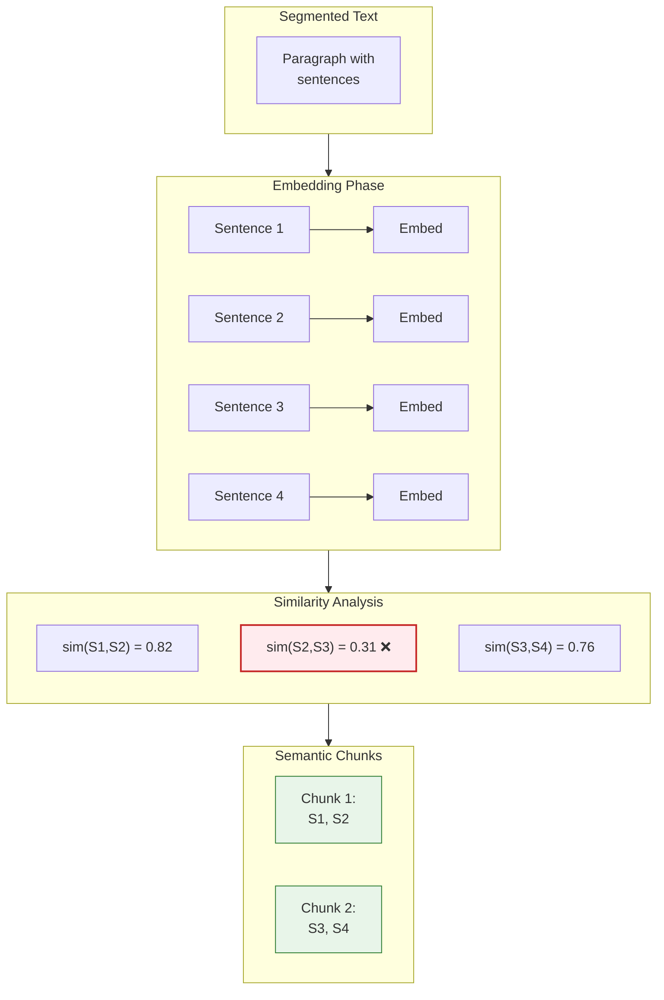

# Semantic Chunking

[← Section Chunking](section-chunking.md) | [Home](../../README.md)

> **Research:** [Chroma Research on Chunking](https://arxiv.org/abs/2410.13070) | October 2024

Splits text at semantic boundaries detected by embedding similarity, creating chunks that preserve topic coherence rather than splitting mid-argument.

**Type:** Index-time chunking | **LLM Calls:** 0 | **Embedding Calls:** 1 per sentence

---

## Diagram



---

## Theory

### The Core Problem

Fixed-size chunking often splits mid-topic, fragmenting semantically related content:

```
Fixed-size split (token boundary):
Chunk 1: "...dopamine regulates reward. The mesolimbic pathway extends from"
Chunk 2: "the VTA to the nucleus accumbens, where dopamine release signals..."

Problem: Splits a complete thought about the dopamine pathway.

Semantic split (topic boundary):
Chunk 1: "...dopamine regulates reward. The mesolimbic pathway extends from
          the VTA to the nucleus accumbens, where dopamine release signals..."
Chunk 2: "Serotonin, in contrast, modulates mood through different mechanisms..."

Better: Complete dopamine discussion, then serotonin topic.
```

### Research Background

Semantic chunking has been explored through several approaches:

| Method | Description | Limitation |
|--------|-------------|------------|
| **Percentile-based** (LangChain/LlamaIndex) | Split at 95th percentile of cosine distances | Varies with document; same threshold means different things |
| **Gradient-based** (Kamradt, 2023) | Split where similarity drops sharply | Computationally expensive; still percentile-based |
| **Absolute threshold** (Chroma, 2024) | Split when similarity < fixed value | **Consistent across documents** |

The Chroma research (arXiv:2410.13070) tested absolute thresholds from 0.1-0.5 and found:
- **Absolute thresholds provide consistent behavior** across different document types
- **0.40-0.43 range** works well for excerpt relevance filtering
- Lower thresholds (0.3) create larger, more contextual chunks
- Higher thresholds (0.75) create smaller, topic-focused chunks

### The Trade-off

```
                    ← Larger chunks              Smaller chunks →
                    ← Fewer splits               More splits →

Threshold:    0.3 ─────────── 0.4 ─────────── 0.5 ─────────── 0.75
              │                │                │                │
              More context     Balanced         Topic-focused    Fragmented
              Risk: noise      (Recommended)    Risk: orphaned   Risk: lost
                                               sentences         coherence
```

---

## Implementation in RAGLab

### Algorithm

```
For each paragraph:
  1. Embed all sentences (batch API call)
  2. Compute cosine similarity between adjacent sentences
  3. Mark breakpoints where similarity < THRESHOLD

For each sentence:
  4. If breakpoint: save current chunk, start new chunk with overlap
  5. If (chunk + sentence) > MAX_TOKENS: save chunk, start new with overlap
  6. Add sentence to current chunk
```

### Key Design Decisions

| Decision | Value | Rationale |
|----------|-------|-----------|
| **Threshold** | 0.4 (configurable) | Chroma research shows 0.40-0.43 optimal for relevance |
| **Percentile vs Absolute** | Absolute | Consistent behavior across documents |
| **Still respect sections** | Yes | Section boundaries trump semantic similarity |
| **Still enforce MAX_TOKENS** | Yes (800) | Embedding model sweet spot |
| **Overlap** | 2 sentences | Same as section chunking for continuity |

### Differences from LangChain/LlamaIndex

1. **Absolute threshold**: We use 0.4 (configurable), not 95th percentile
2. **Token guarantee**: MAX_TOKENS enforced even if semantic suggests larger chunks
3. **Section awareness**: Never cross section boundaries regardless of similarity
4. **Threshold in folder name**: Output like `semantic_0.4/` enables A/B testing

### Similarity Computation

```python
# src/rag_pipeline/chunking/semantic_chunker.py

def compute_similarity_breakpoints(
    sentences: List[str],
    threshold: float = 0.4,
) -> List[int]:
    """Find semantic breakpoints by embedding similarity."""

    # Embed all sentences (batch API call)
    embeddings = embed_texts(sentences)
    embeddings_array = np.array(embeddings)

    # Normalize for cosine similarity
    norms = np.linalg.norm(embeddings_array, axis=1, keepdims=True)
    normalized = embeddings_array / norms

    # Compute adjacent similarities
    breakpoints = [0]  # Always start at 0
    for i in range(len(normalized) - 1):
        sim = np.dot(normalized[i], normalized[i + 1])
        if sim < threshold:
            breakpoints.append(i + 1)  # Start new chunk

    return breakpoints
```

### Configurable Threshold

```bash
# Default threshold (0.4)
python -m src.stages.run_stage_4_chunking --strategy semantic

# Stricter threshold (more splits, smaller chunks)
python -m src.stages.run_stage_4_chunking --strategy semantic --threshold 0.5

# Looser threshold (fewer splits, larger chunks)
python -m src.stages.run_stage_4_chunking --strategy semantic --threshold 0.3
```

Output folders are named by threshold (`semantic_0.4/`, `semantic_0.3/`) to enable comparing different configurations.

---

## Performance in This Pipeline

### Key Finding: Best Precision, But Precision Doesn't Convert to Answers

From comprehensive evaluation across 102 configurations:

| Metric | Semantic 0.3 | Semantic 0.75 | Contextual | Section |
|--------|--------------|---------------|------------|---------|
| Context Precision | **73.4%** (1st) | 71.2% | 71.7% | 69.1% |
| Context Recall | 93.3% | 86.1% | **96.3%** | 92.9% |
| Answer Correctness | 54.1% (4th) | 50.8% (5th) | **59.1%** | 57.6% |
| Faithfulness | 90.2% | 85.4% | 93.9% | 95.0% |

### Why High Precision Doesn't Win

The evaluation revealed a critical insight: **recall matters more than precision for answer quality**.

```
Semantic 0.3:   Precision 73.4% (best) → Answer Correctness 54.1% (4th)
Contextual:     Precision 71.7% (2nd) → Answer Correctness 59.1% (best)
```

The generator LLM can filter irrelevant context (low precision is recoverable) but cannot invent missing information (low recall is unrecoverable). Semantic 0.3's stricter boundaries improve precision by removing borderline-relevant content, but this sometimes excludes information the answer needs.

### Cross-Domain Degradation

| Strategy | Single-Concept Recall | Cross-Domain Recall | Delta |
|----------|----------------------|---------------------|-------|
| Section | 92.9% | 76.3% | **-16.6%** (best) |
| Contextual | 96.3% | 79.4% | -16.8% |
| Semantic 0.3 | 93.3% | 69.3% | -24.0% |
| Semantic 0.75 | 86.1% | 55.6% | **-30.5%** (worst) |

Semantic chunking shows **steeper recall degradation** on cross-domain queries. The embedding-based boundaries work well within topics but struggle when questions require connecting concepts across different semantic spaces.

### Threshold Comparison

| Threshold | Precision | Recall | Correctness | Use Case |
|-----------|-----------|--------|-------------|----------|
| **0.3** | 73.4% | 93.3% | 54.1% | Single-domain, precision focus |
| **0.4** | ~72% | ~91% | ~53% | Balanced default |
| **0.75** | 71.2% | 86.1% | 50.8% | Avoid - too fragmented |

---

## Cost Analysis

Semantic chunking is **more expensive than section chunking** due to embedding API calls:

For 19 books with ~50,000 sentences:
- **Embedding calls**: ~50,000 sentences × $0.13/1M tokens = ~$0.65
- **Processing time**: ~30 minutes (dominated by API rate limits)
- **No LLM calls**: Unlike contextual chunking

Compared to alternatives:
| Strategy | Indexing Cost | Indexing Time |
|----------|--------------|---------------|
| Section | $0 | ~1 minute |
| **Semantic** | ~$0.65 | ~30 minutes |
| Contextual | ~$2-3 | ~2-3 hours |
| RAPTOR | ~$0.40 | ~3 minutes/book |

---

## When to Use

| Scenario | Recommendation |
|----------|----------------|
| **Single-domain corpus** | Good choice - high precision within topic |
| Precision is critical | Best precision (73.4%) of all strategies |
| Fast A/B testing | Threshold parameter enables quick experiments |
| Cost-sensitive (vs Contextual) | No LLM calls, just embeddings |
| **Avoid when** | Cross-domain queries, answer correctness priority |

### Threshold Guidelines

| Threshold | When to Use |
|-----------|-------------|
| **0.3** | Large context is acceptable; maximize topic coherence |
| **0.4** | Balanced default; recommended starting point |
| **0.5** | Topic-focused chunks; some context loss acceptable |
| **0.75+** | Not recommended - creates fragmented chunks |

---

## Running Semantic Chunking

```bash
# Default threshold (0.4)
python -m src.stages.run_stage_4_chunking --strategy semantic

# Custom threshold
python -m src.stages.run_stage_4_chunking --strategy semantic --threshold 0.3

# Then embed and upload
python -m src.stages.run_stage_5_embedding --strategy semantic_0.4
python -m src.stages.run_stage_6_weaviate --strategy semantic_0.4
```

---

## Navigation

**Next:** [Contextual Chunking](contextual-chunking.md) — Adds LLM context to chunks

**Related:**
- [Section Chunking](section-chunking.md) — Simpler baseline without embeddings
- [RAPTOR](raptor.md) — Hierarchical approach for multi-level abstraction
- [Chunking Overview](README.md) — Strategy comparison
