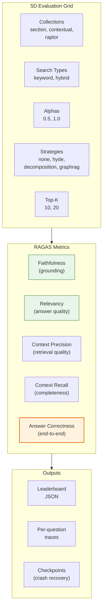

# Evaluation Framework

> **Framework:** [RAGAS (Retrieval-Augmented Generation Assessment)](https://docs.ragas.io/)

RAGLab uses RAGAS for systematic evaluation of RAG strategy combinations across a 5-dimensional grid.

**Type:** End-to-end evaluation | **Test Set:** 45 questions | **Grid:** ~102 configurations

---

## Diagram



---

## Theory

### Why RAGAS?

RAGAS provides metrics that don't require human evaluation for every run:

| Metric | Category | What It Measures | Requires Reference |
|--------|----------|------------------|-------------------|
| **Faithfulness** | Generation | Are claims grounded in retrieved context? | No |
| **Relevancy** | Generation | Does the answer address the question? | No |
| **Context Precision** | Retrieval | Are retrieved chunks actually relevant? | No |
| **Context Recall** | Retrieval | Did retrieval capture all needed info? | Yes |
| **Answer Correctness** | End-to-end | Is the answer factually correct? | Yes |

### Key Insight: Recall > Precision

From our evaluation:

| Strategy | Precision | Recall | Answer Correctness |
|----------|-----------|--------|-------------------|
| Semantic 0.3 | **73.4%** (1st) | 93.3% | 54.1% (4th) |
| Contextual | 71.7% (2nd) | **96.3%** (1st) | **59.1%** (1st) |

The generator LLM can filter irrelevant context (low precision is recoverable) but cannot invent missing information (low recall is unrecoverable).

---

## Implementation in RAGLab

### 5D Evaluation Grid

```
Collections × Search Types × Alphas × Strategies × Top-K
    │             │           │          │           │
    │             │           │          │           └── [10, 20]
    │             │           │          └── [none, hyde, decomposition, graphrag]
    │             │           └── [0.5, 1.0] (hybrid only)
    │             └── [keyword, hybrid]
    └── [section, contextual, raptor]

~102 valid combinations (graphrag only with section/contextual)
```

### Test Dataset

- **45 questions** covering neuroscience and philosophy
- **Human-written reference answers** for each
- **15-question curated subset** for comprehensive grid search

Categories:
- **Single-concept** (5): Factual questions within one domain
- **Cross-domain** (10): Synthesis across neuroscience + philosophy

### CLI Arguments

| Argument | Values | Default | Description |
|----------|--------|---------|-------------|
| `--search-type`, `-s` | keyword, hybrid | hybrid | Weaviate query method |
| `--preprocessing`, `-p` | none, hyde, decomposition, graphrag | none | Query transformation |
| `--alpha`, `-a` | 0.0-1.0 | 0.5 | Hybrid balance (ignored for keyword) |
| `--top-k`, `-k` | int | 10 | Chunks to retrieve |
| `--collection` | string | auto | Weaviate collection name |
| `--comprehensive` | flag | - | Run 5D grid search |

### Running Evaluation

```bash
# Single configuration (full 45 questions)
python -m src.stages.run_stage_7_evaluation \
  --collection RAG_section_embed3large_v1 \
  --search-type hybrid \
  --preprocessing hyde \
  --alpha 0.7 \
  --top-k 15

# Grid search (15-question curated subset)
python -m src.stages.run_stage_7_evaluation --comprehensive

# Retry failed combinations
python -m src.stages.run_stage_7_evaluation --retry-failed comprehensive_20251231_120000
```

---

## Performance Summary

### Best Configurations by Metric

From comprehensive evaluation across 102 configurations:

| Metric | Best Configuration | Value |
|--------|-------------------|-------|
| **Answer Correctness (single)** | Contextual + GraphRAG + Hybrid | 61.7% |
| **Answer Correctness (cross)** | Contextual + GraphRAG + Hybrid | 51.8% |
| **Faithfulness** | RAPTOR + Hybrid α=1.0 | 95.2% |
| **Context Recall** | GraphRAG + Hybrid | 97.5% |
| **Cross-Domain Stability** | HyDE + Hybrid | -10.5% drop |

### Technique Comparison

| Technique | Best For | Limitation |
|-----------|----------|------------|
| **Section** | Consistency, fast iteration | No document context |
| **Contextual** | Answer correctness | LLM cost per chunk |
| **RAPTOR** | Faithfulness, theme questions | Complex infrastructure |
| **HyDE** | Cross-domain stability | LLM latency |
| **Decomposition** | Single-domain multi-step | Fails on cross-domain |
| **GraphRAG** | Cross-domain correctness | Requires Neo4j |

---

## Output Files

### Standard Mode

- **JSON report**: `data/evaluation/ragas_results/eval_{timestamp}.json`
- **Trace file**: `data/evaluation/traces/trace_{run_id}.json`

### Comprehensive Mode

- **Leaderboard JSON**: `data/evaluation/ragas_results/comprehensive_{timestamp}.json`
- **Checkpoint**: `comprehensive_checkpoint_{timestamp}.json`
- **Failed runs**: `failed_combinations_{timestamp}.json`

### Trace Schema

```python
@dataclass
class QuestionTrace:
    question: str
    ground_truth: str
    answer: str
    contexts: List[str]
    metrics: Dict[str, float]
    preprocessing_metadata: Dict[str, Any]

@dataclass
class EvaluationTrace:
    run_id: str
    config: EvaluationConfig
    questions: List[QuestionTrace]
    aggregate_metrics: Dict[str, float]
```

Traces enable metric recalculation without re-running retrieval/generation.

---

## Key Files

| File | Purpose |
|------|---------|
| `src/evaluation/ragas_evaluator.py` | RAGAS metrics + strategy-aware retrieval |
| `src/evaluation/schemas.py` | QuestionTrace, EvaluationTrace, FailedCombination |
| `src/stages/run_stage_7_evaluation.py` | CLI runner + comprehensive grid search |
| `src/evaluation/test_questions.json` | Full 45-question test set |
| `src/evaluation/comprehensive_questions.json` | 15-question curated subset |

---

## Related

- [evaluation-workflow.md](../../memory-bank/evaluation-workflow.md) - Architecture diagrams, caching, retry logic
- [comprehensive-evaluation-synthesis.md](../../memory-bank/insights/comprehensive-evaluation-synthesis.md) - Full analysis of evaluation results
