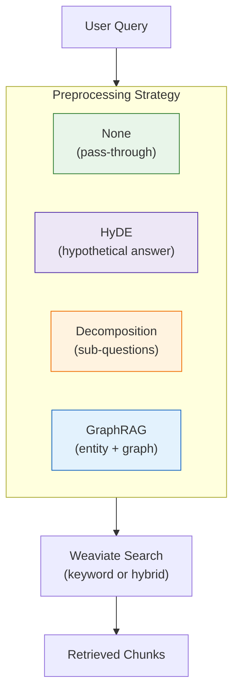

# Preprocessing Strategies

Preprocessing transforms queries before retrieval. This is a **query-time decision** — you can switch strategies without re-indexing.

---

## Strategy Overview



---

## Search Type vs Preprocessing

RAG retrieval has two orthogonal configuration axes:

| Axis | What It Controls | Options |
|------|-----------------|---------|
| **Search Type** | HOW Weaviate searches | `keyword` (BM25), `hybrid` (vector + BM25) |
| **Preprocessing** | Query transformation BEFORE search | `none`, `hyde`, `decomposition`, `graphrag` |

Any preprocessing works with any search type:
- `hyde` + `keyword`: Hypothetical answer → BM25 search
- `decomposition` + `hybrid`: Sub-questions → vector+keyword each

---

## Strategy Comparison

| Strategy | Paper | LLM Calls | Latency | Best For |
|----------|-------|-----------|---------|----------|
| [**None**](none) | — | 0 | ~0ms | Baseline, simple factual queries |
| [**HyDE**](hyde.md) | [arXiv:2212.10496](https://arxiv.org/abs/2212.10496) | 1-2 | ~500ms | Cross-domain stability, vague queries |
| [**Decomposition**](query-decomposition.md) | [arXiv:2507.00355](https://arxiv.org/abs/2507.00355) | 1 | ~500ms | Multi-step within single domain |
| [**GraphRAG**](graphrag.md) | [arXiv:2404.16130](https://arxiv.org/abs/2404.16130) | 1+ | ~1-2s | Cross-domain correctness, entity relations |

---

## Performance Summary

From comprehensive evaluation across 102 configurations:

| Metric | None | HyDE | Decomposition | GraphRAG |
|--------|------|------|---------------|----------|
| **Single-Concept Correctness** | 57.0% | 55.2% | 56.9% | 56.3% |
| **Cross-Domain Correctness** | 47.7% | 47.3% | 47.5% | **50.1%** |
| **Cross-Domain Recall** | 70.5% | **78.8%** | 65.6% | 76.1% |
| **Recall Drop (simple→complex)** | -21.8% | **-10.5%** | -30.4% | -21.4% |

**Key Insights:**
1. **GraphRAG** achieves best cross-domain correctness (+5% over baseline)
2. **HyDE** shows best cross-domain stability (-10.5% drop vs -30.4% for decomposition)
3. **Decomposition** excels at single-domain but fails catastrophically on cross-domain

---

## Trade-offs

### None (Baseline)
- **Pros**: Zero latency, no API cost, deterministic
- **Cons**: Query-document vocabulary mismatch hurts recall
- **Use when**: Simple factual queries, debugging, latency-critical

### HyDE
- **Pros**: Bridges semantic gap, best cross-domain stability
- **Cons**: LLM latency (~500ms), hypothetical may mismatch corpus
- **Use when**: Vague queries, vocabulary mismatch, simple infrastructure

### Decomposition
- **Pros**: Best precision on single-domain multi-step questions
- **Cons**: Fails on cross-domain (-30.4% recall drop)
- **Use when**: "What, then how, then why?" within single domain

### GraphRAG
- **Pros**: Best cross-domain correctness, entity relationships
- **Cons**: Requires Neo4j, complex setup, ~1-2s latency
- **Use when**: Cross-document synthesis, "How does X relate to Y?"

---

## Strategy Flow

```
User Query
    │
    ▼
┌─────────────────────────────────────────────────────────────┐
│  PREPROCESSING STRATEGY                                      │
│                                                              │
│  none:          query → query (unchanged)                    │
│  hyde:          query → hypothetical_passage(s)              │
│  decomposition: query → [sub_query_1, sub_query_2, ...]      │
│  graphrag:      query → query + entity_hints + community     │
└─────────────────────────────────────────────────────────────┘
    │
    ▼
┌─────────────────────────────────────────────────────────────┐
│  SEARCH TYPE (Weaviate)                                      │
│                                                              │
│  keyword:  BM25 only (pure term matching)                    │
│  hybrid:   BM25 + Vector (alpha controls balance)            │
└─────────────────────────────────────────────────────────────┘
    │
    ▼
┌─────────────────────────────────────────────────────────────┐
│  MERGING (if multi-query)                                    │
│                                                              │
│  Single query:  Return directly                              │
│  Multi-query:   RRF merge (decomposition)                    │
│  GraphRAG:      Boost & reorder (graph-matched first)        │
└─────────────────────────────────────────────────────────────┘
    │
    ▼
Ranked Chunks → Generation
```

---

## Running Strategies

```bash
# Via CLI
python -m src.stages.run_stage_7_evaluation --preprocessing none
python -m src.stages.run_stage_7_evaluation --preprocessing hyde
python -m src.stages.run_stage_7_evaluation --preprocessing decomposition
python -m src.stages.run_stage_7_evaluation --preprocessing graphrag

# Combined with search type
python -m src.stages.run_stage_7_evaluation --search-type keyword --preprocessing hyde
python -m src.stages.run_stage_7_evaluation --search-type hybrid --alpha 0.7 --preprocessing decomposition

# Grid search all combinations
python -m src.stages.run_stage_7_evaluation --comprehensive
```

Via UI: Select strategy in Streamlit sidebar dropdown.

---

## Selection Guide

```
Query type:
    │
    ├── Simple factual? ───────────────────► None
    │
    ├── Vague/contextual? ─────────────────► HyDE
    │
    ├── Multi-step, single domain?
    │       │
    │       └── "What, then how?" ─────────► Decomposition
    │
    └── Cross-domain synthesis?
            │
            ├── No Neo4j available? ───────► HyDE
            │
            └── Best correctness needed? ──► GraphRAG
```

**Anti-Pattern:** Don't use Decomposition for cross-domain queries. It fragments the synthesis and loses bridging chunks.

---

## Related

- [Chunking Strategies](../chunking/README.md) — Index-time document splitting
- [Evaluation Framework](../evaluation/README.md) — How strategies are compared
- [RRF Implementation](../../src/rag_pipeline/retrieval/rrf.py) — Merge algorithm for multi-query
