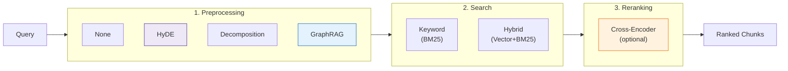
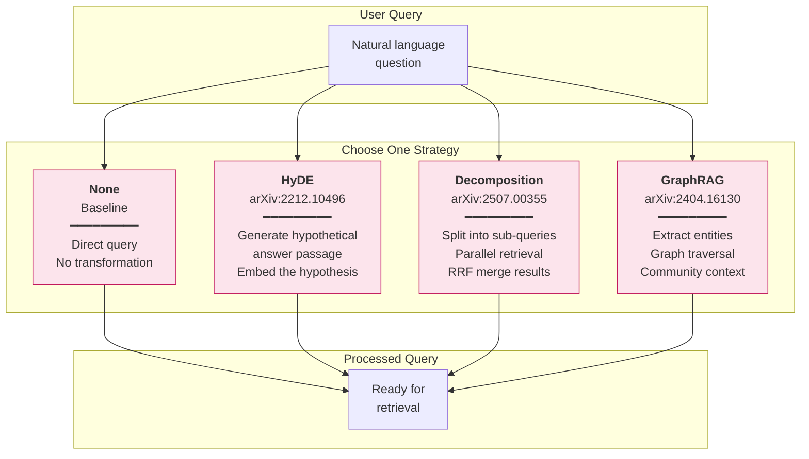

# Query-Time Strategies

[← RAPTOR](../chunking/raptor.md) | [Home](../../README.md)

Query-time strategies transform or enhance retrieval at query time. This is a **query-time decision** — you can switch strategies without re-indexing.

---

## Pipeline Overview



**Three stages:**
1. **Preprocessing** — Transform query before search (HyDE, Decomposition, GraphRAG)
2. **Search** — Retrieve candidates from Weaviate (keyword or hybrid)
3. **Reranking** — Re-score candidates with cross-encoder (optional)

---

## Strategy Comparison

### Preprocessing (Before Search)

| Strategy | Paper | LLM Calls | Latency | Best For |
|----------|-------|-----------|---------|----------|
| **None** | — | 0 | ~0ms | Baseline, simple factual queries |
| [**HyDE**](hyde.md) | [arXiv:2212.10496](https://arxiv.org/abs/2212.10496) | 1-2 | ~500ms | Cross-domain stability, vague queries |
| [**Decomposition**](query-decomposition.md) | [arXiv:2507.00355](https://arxiv.org/abs/2507.00355) | 1 | ~500ms | Multi-step within single domain |
| [**GraphRAG**](graphrag.md) | [arXiv:2404.16130](https://arxiv.org/abs/2404.16130) | 1+ | ~1-2s | Cross-domain correctness, entity relations |

### Reranking (After Search)

| Strategy | Model | Latency | Best For |
|----------|-------|---------|----------|
| **None** | — | 0ms | Speed, debugging |
| [**Cross-Encoder**](reranking.md) | mxbai-rerank-large-v1 | ~1s CPU / ~0.1s GPU | Production accuracy |

Anthropic found that **hybrid search + reranking reduces retrieval failures by 67%** compared to vector-only search.

---

## Performance Summary

From comprehensive evaluation across 102 configurations:

| Metric | None | HyDE | Decomposition | GraphRAG |
|--------|------|------|---------------|----------|
| **Single-Concept Correctness** | 57.0% | 55.2% | 56.9% | 56.3% |
| **Cross-Domain Correctness** | 47.7% | 47.3% | 47.5% | **50.1%** |
| **Cross-Domain Recall** | 70.5% | **78.8%** | 65.6% | 76.1% |
| **Recall Drop (simple→complex)** | -21.8% | **-10.5%** | -30.4% | -21.4% |

**Key Insights:**
1. **GraphRAG** achieves best cross-domain correctness (+5% over baseline)
2. **HyDE** shows best cross-domain stability (-10.5% drop vs -30.4% for decomposition)
3. **Decomposition** excels at single-domain but fails catastrophically on cross-domain

---

## Trade-offs

### Preprocessing

| Strategy | Pros | Cons | Use When |
|----------|------|------|----------|
| **None** | Zero latency, deterministic | Vocabulary mismatch | Simple factual queries |
| **HyDE** | Best cross-domain stability | LLM latency | Vague queries, no Neo4j |
| **Decomposition** | Best single-domain precision | Fails cross-domain | "What, then how?" |
| **GraphRAG** | Best cross-domain correctness | Requires Neo4j | Entity relationships |

### Reranking

| Strategy | Pros | Cons | Use When |
|----------|------|------|----------|
| **None** | Fast, no model load | Lower precision | Evaluation, debugging |
| **Cross-Encoder** | +20-35% precision | +1s latency, 1.2GB model | Production Q&A |

---


#### Query Preprocessing Strategies (Query-Time)




## Strategy Flow

```
User Query
    │
    ▼
┌─────────────────────────────────────────────────────────────┐
│  1. PREPROCESSING                                            │
│                                                              │
│  none:          query → query (unchanged)                    │
│  hyde:          query → hypothetical_passage(s)              │
│  decomposition: query → [sub_query_1, sub_query_2, ...]      │
│  graphrag:      query → query + entity_hints + community     │
└─────────────────────────────────────────────────────────────┘
    │
    ▼
┌─────────────────────────────────────────────────────────────┐
│  2. SEARCH (Weaviate)                                        │
│                                                              │
│  keyword:  BM25 only (pure term matching)                    │
│  hybrid:   BM25 + Vector (alpha controls balance)            │
│  candidates: 50 if reranking, else top_k                     │
└─────────────────────────────────────────────────────────────┘
    │
    ▼
┌─────────────────────────────────────────────────────────────┐
│  3. RERANKING (optional)                                     │
│                                                              │
│  disabled:  Return search results directly                   │
│  enabled:   Cross-encoder scores 50 → top_k                  │
│             Model: mxbai-rerank-large-v1 (560M params)       │
└─────────────────────────────────────────────────────────────┘
    │
    ▼
┌─────────────────────────────────────────────────────────────┐
│  4. MERGING (if multi-query)                                 │
│                                                              │
│  Single query:  Return directly                              │
│  Multi-query:   RRF merge (decomposition)                    │
│  GraphRAG:      Boost & reorder (graph-matched first)        │
└─────────────────────────────────────────────────────────────┘
    │
    ▼
Ranked Chunks → Generation
```

---

## Running Strategies

```bash
# Preprocessing strategies
python -m src.stages.run_stage_7_evaluation --preprocessing none
python -m src.stages.run_stage_7_evaluation --preprocessing hyde
python -m src.stages.run_stage_7_evaluation --preprocessing decomposition
python -m src.stages.run_stage_7_evaluation --preprocessing graphrag

# With reranking (slower, more accurate)
python -m src.stages.run_stage_7_evaluation --preprocessing hyde --reranking

# Combined with search type
python -m src.stages.run_stage_7_evaluation --search-type keyword --preprocessing hyde
python -m src.stages.run_stage_7_evaluation --search-type hybrid --alpha 0.7

# Grid search (reranking disabled for speed)
python -m src.stages.run_stage_7_evaluation --comprehensive
```

Via UI: Select preprocessing in dropdown, toggle reranking checkbox.

---

## Selection Guide

```
Query type:
    │
    ├── Simple factual? ───────────────────► None + Hybrid
    │
    ├── Vague/contextual? ─────────────────► HyDE + Hybrid
    │
    ├── Multi-step, single domain?
    │       │
    │       └── "What, then how?" ─────────► Decomposition + Hybrid
    │
    └── Cross-domain synthesis?
            │
            ├── No Neo4j available? ───────► HyDE + Hybrid
            │
            └── Best correctness needed? ──► GraphRAG + Hybrid

Production deployment? ─────────────────────► Add Reranking
```

**Anti-Patterns:**
- Don't use Decomposition for cross-domain queries (fragments synthesis)
- Don't enable reranking for grid search evaluation (too slow)

---

## Navigation

**Next:** [HyDE](hyde.md) — Hypothetical document embeddings

**Related:**
- [Chunking Strategies](../chunking/README.md) — Index-time document splitting
- [Evaluation Framework](../evaluation/README.md) — How strategies are compared
