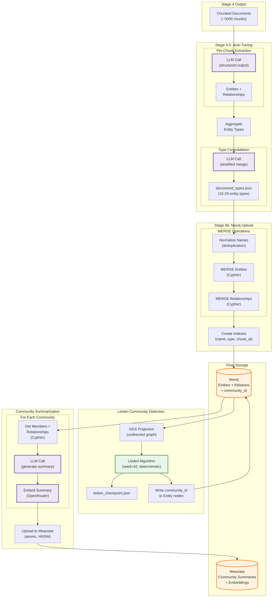
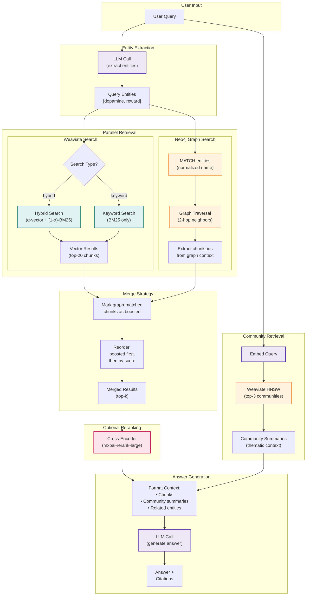
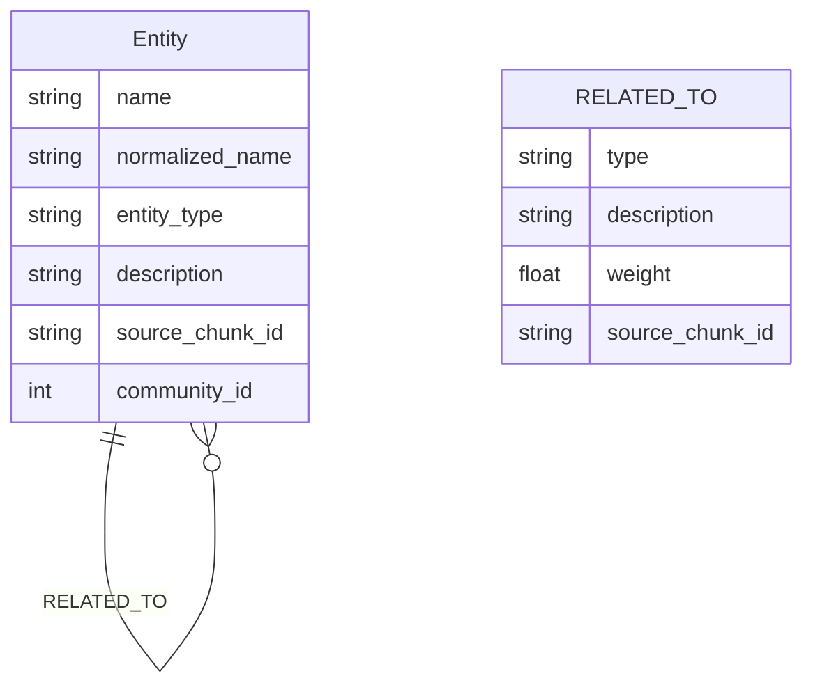

# GraphRAG: Knowledge Graph + Communities

> **Paper:** [From Local to Global: A Graph RAG Approach to Query-Focused Summarization](https://arxiv.org/abs/2404.16130) | Edge et al. (Microsoft Research) | April 2024

Builds a knowledge graph from entities and relationships in the corpus, then uses Leiden community detection to create hierarchical summaries. Enables cross-document synthesis for "big picture" questions.

## TL;DR

GraphRAG extracts entities (people, concepts, brain regions) and relationships from each chunk, builds a knowledge graph in Neo4j, runs Leiden community detection to find clusters of related entities, and generates LLM summaries for each community. At query time, it combines vector search with graph traversal using a boost-and-reorder strategy.

## Key Results (Paper)

- **72-83% win rate** on comprehensiveness vs baseline RAG
- **62-82% win rate** on diversity of answers
- **97% fewer tokens** at query time using community summaries

## The Problem

Vector search excels at finding specific facts but fails on "global" questions:

```
Query: "What are the main themes across all 19 books?"
```

No single chunk contains this answer. Traditional RAG would retrieve random chunks that happen to match keywords.

## The Solution

### Indexing Pipeline (Offline)



**LLM Calls (purple):** 4 types during indexing
1. **Entity extraction** - Per chunk, extracts entities + relationships
2. **Type consolidation** - Merges similar types, balances domains
3. **Community summary** - Generates thematic description per community
4. **Summary embedding** - Converts summary to vector for retrieval

---

### Query Pipeline (Online)



**LLM Calls (purple):** 3 types during query
1. **Entity extraction** - Identifies entities mentioned in query
2. **Query embedding** - Converts query to vector for community search
3. **Answer generation** - Synthesizes answer from retrieved context

**Database Operations:**
- **Weaviate (teal):** Hybrid/keyword search on chunks, HNSW search on communities
- **Neo4j (orange):** Entity matching, 2-hop graph traversal

---

### Neo4j Graph Schema



**Cypher Queries:**
```cypher
-- Entity lookup (case-insensitive)
MATCH (e:Entity)
WHERE toLower(e.normalized_name) = toLower($name)
RETURN e

-- 2-hop traversal
MATCH path = (start:Entity {normalized_name: $name})-[*1..2]-(neighbor)
WHERE start <> neighbor
RETURN DISTINCT neighbor, length(path) as hops
ORDER BY hops
LIMIT 50
```

### Key Components

**1. Entity Extraction**: LLM identifies named entities and relationships from each chunk

**2. Knowledge Graph**: Neo4j stores entities as nodes, relationships as edges

**3. Leiden Communities**: Groups of densely connected entities (Leiden is improved Louvain)

**4. Community Summaries**: LLM-generated descriptions of what each community represents

## Implementation Details

### Entity Extraction

```python
# src/graph/extractor.py

def extract_from_chunk(chunk: Dict, model: str) -> ExtractionResult:
    """Extract entities and relationships from a chunk."""

    prompt = GRAPHRAG_EXTRACTION_PROMPT.format(
        entity_types=", ".join(GRAPHRAG_ENTITY_TYPES),
        relationship_types=", ".join(GRAPHRAG_RELATIONSHIP_TYPES),
        text=chunk["text"],
    )

    # Use structured output for reliable JSON parsing
    result = call_structured_completion(
        messages=[{"role": "user", "content": prompt}],
        model=model,
        response_model=ExtractionResult,
        temperature=0.0,  # Deterministic
    )

    return result
```

### Entity Types (Domain-Specific)

```python
# src/config.py

GRAPHRAG_ENTITY_TYPES = [
    # Neuroscience
    "BRAIN_REGION",      # Prefrontal cortex, amygdala
    "NEUROTRANSMITTER",  # Dopamine, serotonin
    "RESEARCHER",        # Sapolsky, Kahneman

    # Philosophy
    "PHILOSOPHER",       # Marcus Aurelius, Seneca
    "CONCEPT",           # Virtue, hedonic adaptation
    "PRACTICE",          # Meditation, journaling

    # Cross-domain
    "BOOK", "THEORY", "PRINCIPLE"
]

GRAPHRAG_RELATIONSHIP_TYPES = [
    "AUTHORED", "RESEARCHES", "RELATES_TO",
    "INFLUENCES", "TEACHES", "SUPPORTS"
]
```

### Neo4j Schema

```cypher
// Nodes
(:Entity {
  name: String,
  type: String,
  description: String,
  chunk_ids: [String],
  mention_count: Integer
})

// Relationships
(:Entity)-[:RELATED_TO {
  description: String,
  strength: Integer,
  source_chunk_id: String
}]->(:Entity)

// Community assignments (from Leiden)
(:Entity)-[:BELONGS_TO]->(:Community)
```

### Leiden Community Detection

```python
# src/graph/community.py

def project_graph(gds: GraphDataScience, graph_name: str) -> Any:
    """Create GDS graph projection for community detection."""
    graph, result = gds.graph.project(
        graph_name,
        "Entity",
        {"RELATED_TO": {"orientation": "UNDIRECTED"}}
    )
    return graph

def detect_communities(gds, graph) -> List[Dict]:
    """Run Leiden algorithm."""
    result = gds.leiden.stream(
        graph,
        maxLevels=GRAPHRAG_LEIDEN_MAX_LEVELS,
        gamma=GRAPHRAG_LEIDEN_RESOLUTION,
    )
    return result.to_dict("records")
```

### Community Summarization

```python
def summarize_community(members: List[Dict], model: str) -> str:
    """Generate LLM summary for a community."""

    # Build context from member entities
    context = "\n".join([
        f"- {m['name']} ({m['type']}): {m['description']}"
        for m in members
    ])

    prompt = GRAPHRAG_COMMUNITY_PROMPT.format(
        entity_list=context,
        relationship_summary=...,
    )

    return call_chat_completion(
        messages=[{"role": "user", "content": prompt}],
        model=model,
        max_tokens=GRAPHRAG_MAX_SUMMARY_TOKENS,
    )
```

### Query-Time Hybrid Retrieval

```python
# src/graph/query.py

def hybrid_graph_retrieval(
    query: str,
    preprocessed: PreprocessedQuery,
    weaviate_client,
    neo4j_driver,
) -> Tuple[List[Dict], Dict]:
    """Combine vector search with graph-based retrieval."""

    # 1. Vector search (standard)
    vector_results = weaviate_client.query_hybrid(query, ...)

    # 2. Extract entities from query
    query_entities = extract_query_entities(query, neo4j_driver)

    # 3. Graph traversal: find chunk IDs connected to query entities
    graph_chunk_ids = traverse_entity_neighbors(query_entities, neo4j_driver)

    # 4. Get community summaries as additional context
    community_context = get_community_summaries(query_entities, neo4j_driver)

    # 5. Boost & reorder: graph-matched chunks first
    enriched = enrich_results_with_graph(vector_results, graph_chunk_ids, community_context)
    boosted = [r for r in enriched if r.get("graph_boost")]
    non_boosted = [r for r in enriched if not r.get("graph_boost")]
    merged = boosted + non_boosted  # Boosted first, then by original score

    return merged, {"community_context": community_context}
```

**Note:** This is a simple boost strategy. RRF merging could provide more sophisticated ranking but adds complexity.

### Design Decisions

**Why Neo4j (not in-memory graph)?**
- GDS plugin provides Leiden algorithm
- Persistent storage for large graphs
- Cypher queries for flexible traversal
- Production-ready scaling

**Why Leiden (not Louvain)?**
- Guarantees connected communities (Louvain can produce disconnected ones)
- Better resolution parameter behavior
- Standard in GraphRAG implementations

**Why structured output for extraction?**
- JSON schema enforces consistent format
- Pydantic validation catches errors
- Reduces parsing failures

## When to Use

**Good for:**
- "Big picture" questions across documents
- Entity-relationship queries ("How does X relate to Y?")
- Theme and pattern discovery
- Cross-book synthesis

**Limitations:**
- Complex setup (Neo4j + GDS plugin)
- Higher indexing cost (entity extraction per chunk)
- Latency from Neo4j queries
- Overkill for simple factual queries

## Cost Analysis

For 19 books:
- **Entity extraction**: ~5,000 chunks × 1 LLM call = ~$3-5
- **Community summarization**: ~100 communities × 1 LLM call = ~$0.50
- **Storage**: Neo4j container (~500MB RAM)

## Pipeline Commands

```bash
# 1. Extract entities with auto-tuning (discovers types from corpus)
python -m src.stages.run_stage_4_5_autotune --strategy section

# 2. Upload to Neo4j + run Leiden
docker compose up -d neo4j
python -m src.stages.run_stage_6b_neo4j

# 3. Query with graphrag strategy
python -m src.stages.run_stage_7_evaluation --preprocessing graphrag
```

> **Note:** An alternative approach uses predefined entity types from `config.py`,
> but auto-tuning is recommended as it discovers types specific to your corpus.

## Results

See [Evaluation Results](../evaluation/results.md) for RAGAS metrics comparing GraphRAG against none, HyDE, and decomposition strategies.

---

## Crash-Proof Design (v2)

> **Added:** 2025-12-29 | **Status:** Complete

Stage 6b (Neo4j upload + Leiden + summarization) takes ~10 hours and costs ~$10. The original design was vulnerable to crashes, network errors, and API limits. This section documents the crash-proof redesign.

### The Problem

**Original workflow had three vulnerabilities:**

1. **Leiden is non-deterministic** - Each run produces different community IDs
2. **JSON file grows to 383MB** - Embeddings stored inline (inefficient)
3. **Resume doesn't work after Neo4j reset** - Community IDs mismatch

```
Crash Scenario:
─────────────────────────────────────────────────────────────
1. Run Stage 6b (10 hours)
2. Crash at community 475/7734 (Neo4j password issue)
3. Delete Neo4j data to fix password
4. Try to resume → BROKEN!
   • Leiden produces DIFFERENT community IDs
   • JSON file has "community_5" but new run assigns those entities to "community_847"
   • Resume skips "community_5" (exists in file) but it's now DIFFERENT entities!
```

### The Solution

**Three key changes:**

1. **Deterministic Leiden** - `randomSeed=42` + `concurrency=1`
2. **Weaviate storage** - Community embeddings in Weaviate, not JSON
3. **Checkpoint file** - Small JSON with Leiden assignments for verification

### Deterministic Leiden

Neo4j GDS Leiden supports deterministic results:

```python
# Before (non-deterministic):
gds.leiden.stream(graph, gamma=1.0, maxLevels=3)

# After (deterministic):
gds.leiden.stream(
    graph,
    gamma=1.0,
    maxLevels=3,
    randomSeed=42,      # Fixed seed
    concurrency=1,      # Single-threaded
)
```

**Same graph + same seed = same community assignments** (guaranteed).

### Weaviate Community Storage

**Before:** 383MB JSON file with inline embeddings (81% of size)

**After:** Weaviate collection + small metadata file

```
Weaviate "Community_section_v1" collection:
├── community_id (string)
├── summary (text)
├── member_count (int)
├── level (int)
└── vector (embedding)  ← Efficient HNSW storage

leiden_checkpoint.json (~2MB):
├── seed: 42
├── timestamp: "2025-12-29T10:00:00"
└── assignments: [{node_id, entity_name, community_id}, ...]
```

**Query flow:**
```python
# Before: Load 383MB JSON, loop all communities, compute cosine similarity
communities = load_communities()  # 383MB into RAM
for c in communities:
    similarity = cosine_similarity(query_emb, c.embedding)

# After: Query Weaviate directly
results = weaviate.query.near_vector(
    query_embedding,
    limit=3,
    return_properties=["community_id", "summary", "member_count"]
)
```

### Crash Recovery Matrix

| Crash Point | State | Recovery |
|-------------|-------|----------|
| During Upload | Neo4j partial | Re-run. MERGE is idempotent. |
| During Leiden | No community_ids | Re-run Leiden (deterministic). |
| During Summarization | Weaviate partial | `--resume`: skips existing. |
| Neo4j deleted | Weaviate has summaries | Re-upload + Leiden (same seed = same IDs). |

### New Workflow Diagram

```
extraction_results.json (source of truth)
         │
         ▼
┌─────────────────────────────────────────────────────────────┐
│ PHASE 1: UPLOAD (idempotent)                               │
│   upload_extraction_results()  ── MERGE = safe to re-run   │
└─────────────────────────────────────────────────────────────┘
         │
         ▼
┌─────────────────────────────────────────────────────────────┐
│ PHASE 2: LEIDEN (deterministic)                            │
│   gds.leiden.stream(..., randomSeed=42, concurrency=1)     │
│   save_leiden_checkpoint()  ──► leiden_checkpoint.json     │
└─────────────────────────────────────────────────────────────┘
         │
         ▼
┌─────────────────────────────────────────────────────────────┐
│ PHASE 3: SUMMARIZATION (resumable)                         │
│   existing_ids = get_community_ids_from_weaviate()         │
│   for community_id in unique_ids:                          │
│       if community_id in existing_ids: continue            │
│       summary = summarize_community(...)                   │
│       upload_to_weaviate(community)  ← Atomic per item     │
└─────────────────────────────────────────────────────────────┘
         │
         ▼
Weaviate Community collection + leiden_checkpoint.json
```

### File Size Comparison

| Storage | Before | After |
|---------|--------|-------|
| communities.json | 383 MB | 0 (deleted) |
| leiden_checkpoint.json | N/A | ~2 MB |
| Weaviate collection | N/A | ~10 MB |
| **Total** | **383 MB** | **~12 MB** |

### CLI Changes

```bash
# Full run (deterministic Leiden, saves to Weaviate)
python -m src.stages.run_stage_6b_neo4j

# Resume after crash (skips existing in Weaviate)
python -m src.stages.run_stage_6b_neo4j --resume

# Upload only (no Leiden, no summarization)
python -m src.stages.run_stage_6b_neo4j --upload-only
```

### Code Changes

| File | Change |
|------|--------|
| `config.py` | Add `LEIDEN_SEED = 42` |
| `community.py:run_leiden()` | Add `randomSeed`, `concurrency=1` |
| `community.py` | Add checkpoint save/load functions |
| `weaviate_client.py` | Add Community collection schema + upload |
| `query.py` | Query Weaviate instead of loading JSON |
| `run_stage_6b_neo4j.py` | Use new workflow |

---

## Related

- [RAPTOR](../chunking/raptor.md) — Alternative hierarchy via clustering
- [Query Decomposition](query-decomposition.md) — Alternative for complex queries

**Internal Documentation (memory-bank/):**
- [Quick Reference](../../memory-bank/graphrag.md) — Operational guide, crash recovery, troubleshooting
- [Deep Tutorial](../../memory-bank/graphrag-tutorial.md) — Comprehensive 25k+ line implementation guide
- [2025 SOTA Report](../../memory-bank/graphrag-sota-report.md) — Implementation landscape and benchmarks
