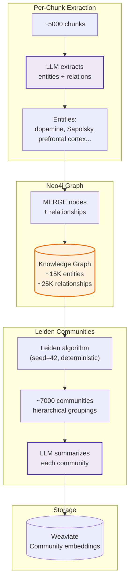
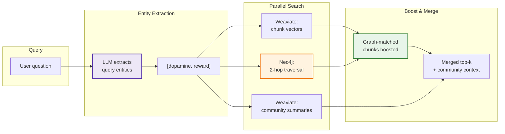
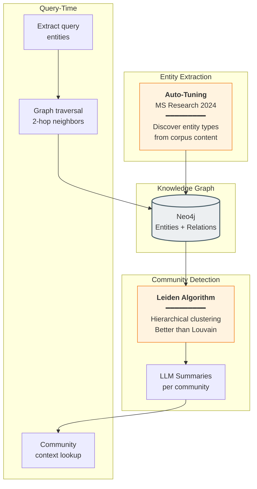

# GraphRAG: Knowledge Graph + Community Detection

> **Paper:** [From Local to Global: A Graph RAG Approach to Query-Focused Summarization](https://arxiv.org/abs/2404.16130) | Edge et al. (Microsoft Research) | April 2024

Builds a knowledge graph from entities and relationships in the corpus, then uses Leiden community detection to create hierarchical summaries. Enables cross-document synthesis for "big picture" questions.

**Type:** Query-time preprocessing | **LLM Calls:** 3 per query | **Latency:** ~1-2s | **Requires:** Neo4j

---

## Diagram: Indexing Pipeline



---

## Diagram: Query Pipeline



---


#### GraphRAG Pipeline Detail



---

## Theory

### The Core Problem

Vector search excels at finding specific facts but fails on "global" questions:

```
Query: "What are the main themes across all 19 books?"
```

No single chunk contains this answer. Traditional RAG retrieves random chunks that happen to match keywords.

### Research Background

Microsoft's April 2024 paper introduced community-based synthesis:

| Metric | GraphRAG | Naive RAG |
|--------|----------|-----------|
| Comprehensiveness | **72-83% win rate** | Baseline |
| Answer diversity | **62-82% win rate** | Baseline |
| Tokens at query time | 97% fewer | Baseline |

**Key insight:** While vector embeddings excel at semantic similarity, they fail on questions requiring multi-hop reasoning across disconnected information—precisely where knowledge graphs shine.

### The Landscape (December 2025)

| Implementation | Stars | Key Innovation |
|----------------|-------|----------------|
| **Microsoft GraphRAG** | ~29,200 | Local/Global/DRIFT search, Leiden communities |
| **LightRAG** | ~26,800 | 6x cheaper, incremental updates |
| **KAG** (Ant Group) | ~7,500 | Logical-form reasoning, +19-33% F1 |
| **HippoRAG** | ~2,100 | PageRank-based, neurobiologically inspired |
| **Neo4j GraphRAG** | ~800 | First-party Neo4j support |

### Leiden vs. Louvain

GraphRAG uses Leiden (not Louvain) for community detection:
- **Guarantees connected communities** (Louvain can produce disconnected ones)
- Better resolution parameter behavior
- Standard in GraphRAG implementations

---

## Implementation in RAGLab

### Algorithm: Indexing (Offline)

```
1. For each chunk: LLM extracts entities + relationships (structured output)
2. Auto-tune entity types from corpus (stratified across books)
3. Upload to Neo4j with MERGE (idempotent, safe to re-run)
4. Run deterministic Leiden (seed=42, concurrency=1)
5. Summarize each community with LLM
6. Embed summaries to Weaviate
```

### Algorithm: Query (Online)

```
1. LLM extracts entities from query
2. Parallel:
   a. Weaviate: hybrid search on chunks
   b. Neo4j: 2-hop traversal from query entities → chunk_ids
   c. Weaviate: top-3 community summaries
3. Boost graph-matched chunks (appear first in ranking)
4. Return merged chunks + community context
```

### Key Design Decisions

| Decision | Microsoft GraphRAG | RAGLab | Rationale |
|----------|-------------------|--------|-----------|
| **Entity extraction** | Gleanings (multiple passes) | Single pass + auto-tune | Cost efficiency for learning |
| **Leiden seed** | Non-deterministic | seed=42, concurrency=1 | Crash recovery |
| **Community storage** | In-memory/JSON | Weaviate collection | Enables HNSW similarity search |
| **Merge strategy** | RRF (complex) | Boost & reorder (simple) | Clarity over marginal gains |

### Differences from Paper

1. **No DRIFT search**: We implement simpler boost-and-reorder (paper's DRIFT is more sophisticated)
2. **Weaviate communities**: Paper stores summaries differently; we use vector similarity for community retrieval
3. **Auto-tuned entity types**: Paper uses predefined types; we discover types from corpus
4. **Deterministic Leiden**: Paper doesn't emphasize reproducibility; we add it for crash recovery

### Entity Extraction (Structured Output)

```python
# src/graph/extractor.py

def extract_from_chunk(chunk: Dict, model: str) -> ExtractionResult:
    """Extract entities and relationships from a chunk."""
    prompt = GRAPHRAG_EXTRACTION_PROMPT.format(
        entity_types=", ".join(discovered_types),
        text=chunk["text"],
    )

    return call_structured_completion(
        messages=[{"role": "user", "content": prompt}],
        model=model,
        response_model=ExtractionResult,
        temperature=0.0,  # Deterministic
    )
```

### Hybrid Graph Retrieval

```python
# src/graph/query.py

def hybrid_graph_retrieval(query, weaviate_client, neo4j_driver):
    # 1. Vector search (standard)
    vector_results = weaviate_client.query_hybrid(query, ...)

    # 2. Extract entities from query
    query_entities = extract_query_entities(query, neo4j_driver)

    # 3. Graph traversal: find chunk IDs connected to query entities
    graph_chunk_ids = traverse_entity_neighbors(query_entities, neo4j_driver)

    # 4. Get community summaries as additional context
    community_context = get_community_summaries(query_entities, neo4j_driver)

    # 5. Boost & reorder: graph-matched chunks first
    boosted = [r for r in vector_results if r.chunk_id in graph_chunk_ids]
    non_boosted = [r for r in vector_results if r.chunk_id not in graph_chunk_ids]
    merged = boosted + non_boosted

    return merged, community_context
```

---

## Performance in This Pipeline

### Key Finding: Best Answer Correctness on Cross-Domain Queries

From comprehensive evaluation across 102 configurations:

| Metric | GraphRAG | None | HyDE | Decomposition |
|--------|----------|------|------|---------------|
| Cross-Domain Correctness | **50.1%** (1st) | 47.7% | 47.3% | 47.5% |
| Single-Concept Correctness | 56.3% | 57.0% | 55.2% | 56.9% |
| Single-Concept Recall | **97.5%** (1st) | 92.3% | 89.3% | 96.0% |

**Primary Takeaway:** GraphRAG achieves the **highest answer correctness on cross-domain queries** (+5% over baseline). The knowledge graph captures **typed relationships** that pure embedding similarity cannot represent.

### Why GraphRAG Excels at Cross-Domain

The knowledge graph explicitly models connections between entities across domains:

```
Query: "How do neuroscience and Stoicism address free will?"

Knowledge Graph Path:
  [Stoic Philosophy] --RELATES_TO--> [Free Will] <--RESEARCHES-- [Neuroscience]
  [Marcus Aurelius] --TEACHES--> [Free Will]
  [Prefrontal Cortex] --RELATES_TO--> [Decision Making]
```

Vector similarity treats "Stoic free will" and "neuroscience free will" as separate concepts. The graph explicitly links them through shared entities.

### Synergy with Contextual Chunking

Best configuration: **Contextual + GraphRAG + Hybrid Search**

| Configuration | Single-Concept Correctness | Cross-Domain Correctness |
|---------------|---------------------------|-------------------------|
| Section + None | 57.6% | 47.9% |
| Contextual + GraphRAG | **61.7%** | **51.8%** |

They operate on orthogonal dimensions:
- **Contextual**: Intra-document clarity (what is this chunk about?)
- **GraphRAG**: Inter-document connections (how do concepts relate?)

---

## Cost Analysis

### Indexing (One-Time)

For 19 books with ~5,000 chunks:

| Phase | LLM Calls | Cost | Time |
|-------|-----------|------|------|
| Entity extraction | ~5,000 | ~$3-5 | ~5h |
| Type consolidation | 1 | ~$0.01 | <1m |
| Community summarization | ~7,000 | ~$2-3 | ~5h |
| **Total** | ~12,000 | ~$5-8 | ~10h |

### Query (Per Request)

| Component | LLM Calls | Latency |
|-----------|-----------|---------|
| Entity extraction | 1 | ~300ms |
| Community retrieval | 0 (Weaviate) | ~50ms |
| Graph traversal | 0 (Neo4j) | ~100ms |
| **Total** | 1 | ~1-2s |

---

## Crash-Proof Design

Stage 6b takes ~10 hours. The implementation is crash-proof:

| Crash Point | Recovery |
|-------------|----------|
| During upload | Re-run. MERGE is idempotent. |
| During Leiden | Re-run. Deterministic with seed=42. |
| During summarization | `--resume`: skips existing in Weaviate. |
| Neo4j deleted | Re-upload + Leiden (same seed = same IDs). |

Key changes from original:
1. **Deterministic Leiden**: `randomSeed=42, concurrency=1`
2. **Weaviate storage**: Communities in Weaviate, not 383MB JSON
3. **Checkpoint file**: Small `leiden_checkpoint.json` for verification

---

## Running GraphRAG

```bash
# 1. Extract entities with auto-tuning
python -m src.stages.run_stage_4_5_autotune --strategy section

# 2. Upload to Neo4j + run Leiden + summarize
docker compose up -d neo4j
python -m src.stages.run_stage_6b_neo4j

# 3. Resume if crashed
python -m src.stages.run_stage_6b_neo4j --resume

# 4. Query with graphrag strategy
python -m src.stages.run_stage_7_evaluation --preprocessing graphrag
```

---

## When to Use

| Scenario | Recommendation |
|----------|----------------|
| Cross-document synthesis | GraphRAG connects entities across books |
| "Big picture" questions | Community summaries provide thematic context |
| Entity-relationship queries | "How does X relate to Y?" |
| **Avoid when** | Simple factual queries, no Neo4j available, latency-critical |

---

## Related

- [RAPTOR](../chunking/raptor.md) - Alternative hierarchy via clustering
- [HyDE](hyde.md) - Simpler alternative for cross-domain (no Neo4j)
- [Query Decomposition](query-decomposition.md) - Avoid for cross-domain
- [Preprocessing Overview](README.md) - Strategy comparison

**Internal Documentation:**
- [Quick Reference](../../memory-bank/graphrag.md) - Operational guide, troubleshooting
- [Deep Tutorial](../../memory-bank/graphrag-tutorial.md) - Implementation guide
- [2025 SOTA Report](../../memory-bank/graphrag-sota-report.md) - Landscape and benchmarks
