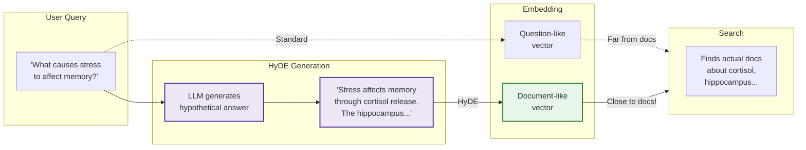

# HyDE: Hypothetical Document Embeddings

> **Paper:** [Precise Zero-Shot Dense Retrieval without Relevance Labels](https://arxiv.org/abs/2212.10496) | Gao et al. (CMU) | ACL 2023

Generates hypothetical answers to the query, then searches for real documents similar to these answers. Bridges the semantic gap between question embeddings and document embeddings.

**Type:** Query-time preprocessing | **LLM Calls:** 1-5 per query | **Latency:** ~500ms

---

## Diagram



---

## Theory

### The Core Problem

Questions and documents live in different semantic spaces:

```
Question: "What causes stress to affect memory?"
          ↓ embedding
          [query vector - interrogative structure]

Document: "Chronic cortisol elevation impairs hippocampal
           neurogenesis and disrupts memory consolidation..."
          ↓ embedding
          [document vector - declarative structure]
```

These vectors may be far apart despite topical relevance because:
- Questions use **interrogative** structure ("What...", "How...")
- Documents use **declarative** structure (statements of fact)
- **Vocabulary differs**: scientific terms vs. conversational phrasing

### Research Background

HyDE (ACL 2023) solves this by generating a hypothetical answer first:

| Finding | Details |
|---------|---------|
| **Minimal prompts work best** | Over-specification causes template bias |
| **Document type matters** | Mention "passage", "paper", "article" without overspecifying vocabulary |
| **Temperature 0.7** | Provides sufficient creativity for diverse hypotheticals |
| **Dense bottleneck filters hallucinations** | The encoder naturally discards incorrect details |

**Key insight:** The embedding model was trained on real documents. When you embed a hypothetical:
- **Preserved**: Topics, concepts, semantic relationships
- **Filtered**: Specific wrong facts, hallucinated details

The fixed-dimension embedding is a "bottleneck" that compresses to semantic essence.

### Original Prompts from Paper

From the official implementation ([texttron/hyde](https://github.com/texttron/hyde)):

| Task | Prompt |
|------|--------|
| Web Search | "Please write a passage to answer the question. Question: {}" |
| SciFact | "Please write a scientific paper passage to support/refute the claim. Claim: {}" |
| FiQA | "Please write a financial article passage to answer the question. Question: {}" |

Note: All prompts are minimal (1-2 sentences), specify document type, and include no examples.

---

## Implementation in RAGLab

### Algorithm

```
1. Receive user query
2. Generate K hypothetical answer passages (K=2 default)
3. Embed all K passages
4. Average embeddings (element-wise mean)
5. Search Weaviate with averaged vector
6. Original query still used for BM25 in hybrid search
```

### Key Design Decisions

| Decision | Paper | RAGLab | Rationale |
|----------|-------|--------|-----------|
| **Temperature** | 0.7 | 0.7 | Paper default for diverse hypotheticals |
| **K (hypotheticals)** | 5 | 2 | Balance cost vs robustness |
| **Domain framing** | Task-specific | Corpus-specific | "brain science and classical philosophy" matches our 19-book corpus |
| **Length constraint** | None | None | Trust encoder to compress |

### Differences from Paper

1. **Corpus-specific hints**: We include "(Stoicism, Taoism, Confucianism, Schopenhauer, Gracian)" to cover all 10 philosophy books without vocabulary lists
2. **Fewer hypotheticals**: K=2 instead of K=5 for cost efficiency
3. **Hybrid integration**: Original query still used for BM25 keyword matching

### HyDE Prompt

```python
# src/rag_pipeline/retrieval/preprocessing/query_preprocessing.py

HYDE_PROMPT = """Please write a short passage drawing on insights from brain science and classical philosophy (Stoicism, Taoism, Confucianism, Schopenhauer, Gracian) to answer the question.

Question: {query}

Passage:"""
```

**Design rationale:**
- **"Drawing on insights from..."** — Requests cross-domain synthesis for our mixed corpus
- **Parenthetical tradition hints** — Provides specific corpus cues without vocabulary lists
- **Minimal structure** — Follows paper's finding that over-specification hurts

### Multi-Hypothetical Generation

```python
def hyde_prompt(query: str, model: str, k: int = HYDE_K) -> List[str]:
    """Generate k hypothetical documents for query."""
    passages = []
    for _ in range(k):
        response = call_chat_completion(
            messages=[{"role": "user", "content": prompt}],
            model=model,
            temperature=0.7,  # Paper default for diversity
        )
        passages.append(response.strip())
    return passages
```

At retrieval time:
1. Embed all K passages using the same embedding model
2. Average the embedding vectors (element-wise mean)
3. Use averaged vector for vector similarity search
4. Original query used for BM25 keyword matching in hybrid mode

---

## Performance in This Pipeline

### Key Finding: Best Cross-Domain Stability

From comprehensive evaluation across 102 configurations:

| Metric | HyDE | None | Decomposition | GraphRAG |
|--------|------|------|---------------|----------|
| Cross-Domain Recall | **78.8%** | 70.5% | 65.6% | 76.1% |
| Cross-Domain Recall Drop | **-10.5%** (best) | -21.8% | -30.4% | -21.4% |
| Cross-Domain Correctness | 47.3% | 47.7% | 47.5% | **50.1%** |

**Primary Takeaway:** HyDE shows the **smallest performance degradation** when moving from single-concept to cross-domain queries (-10.5% recall drop vs -30.4% for decomposition). The hypothetical passage **pre-synthesizes the cross-domain bridge**, creating an embedding that spans both domains.

### Why HyDE Excels at Cross-Domain

Cross-domain queries require finding chunks near **multiple conceptual clusters simultaneously**. A direct query embedding becomes a centroid equidistant from all clusters—optimally far from any specific chunk.

HyDE solves this: the LLM generates a hypothetical that naturally weaves together concepts from both domains, creating an embedding that already spans the conceptual gap.

### Limitation: GraphRAG Beats HyDE on Answer Correctness

While HyDE achieves the best retrieval stability, GraphRAG achieves higher answer correctness (+5.7% over baseline). The knowledge graph captures **typed relationships** that pure embedding similarity cannot.

**Recommendation:** Use HyDE when you need simpler infrastructure (no Neo4j) and care primarily about retrieval robustness. Use GraphRAG when answer quality is paramount.

---

## Cost Analysis

With K=2 hypotheticals (default):

| Component | Tokens | Cost |
|-----------|--------|------|
| LLM input | 2 × ~50 = 100 | ~$0.00002 |
| LLM output | 2 × ~150 = 300 | ~$0.00018 |
| Embeddings | 2 passages vs 1 | 2× embedding cost |
| **Total per query** | ~400 tokens | ~$0.0004 |

Latency: ~500ms (2 serial LLM calls). Parallelizable to ~300ms.

---

## When to Use

| Scenario | Recommendation |
|----------|----------------|
| Vague/contextually ambiguous queries | HyDE bridges vocabulary gap |
| Zero-shot retrieval | No task-specific training needed |
| Cross-domain questions | Smallest performance degradation |
| Query vocabulary differs from corpus | Hypothetical uses domain-appropriate terms |
| **Avoid when** | LLM doesn't know topic, latency-critical, simple keyword queries |

---

## Example

**Query**: "Why do we procrastinate on important tasks?"

**Hypothetical** (generated):
```
Procrastination on important tasks often stems from a conflict between
the limbic system's preference for immediate rewards and the prefrontal
cortex's ability to plan for future goals. Temporal discounting causes
distant deadlines to feel less urgent, while task aversion triggers
avoidance behaviors. Self-regulation failure occurs when cognitive
resources are depleted, making it harder to override impulses...
```

**Retrieval**: Finds chunks about temporal discounting, limbic system, self-regulation—even though the query didn't use those terms.

---

## Related

- [Query Decomposition](query-decomposition.md) - Alternative for multi-part questions
- [GraphRAG](graphrag.md) - Entity-based alternative with higher answer correctness
- [Preprocessing Overview](README.md) - Strategy comparison
- [Paper Implementation](https://github.com/texttron/hyde) - Official reference
