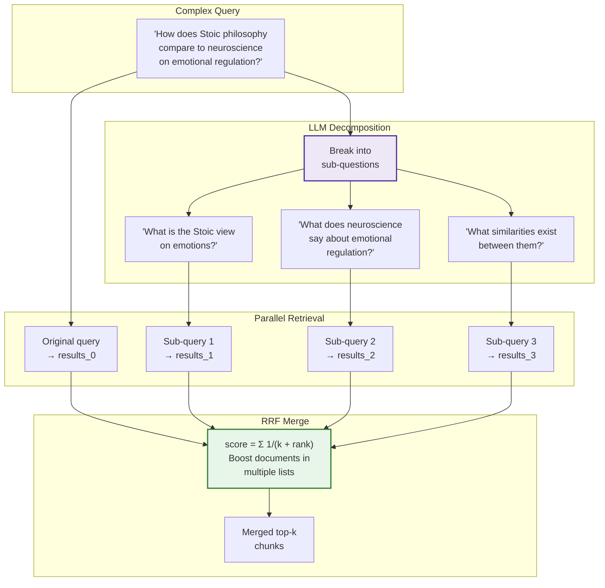

# Query Decomposition

[← HyDE](hyde.md) | [Home](../../README.md)

> **Paper:** [Question Decomposition for Retrieval-Augmented Generation](https://arxiv.org/abs/2507.00355) | Ammann et al. (Humboldt-Universitat) | July 2025

Breaks complex multi-part questions into simpler sub-questions, retrieves for each independently, then merges results using Reciprocal Rank Fusion (RRF).

**Type:** Query-time preprocessing | **LLM Calls:** 1 per query | **Latency:** ~500ms

---

## Diagram



---

## Theory

### The Core Problem

Complex questions require multiple pieces of information:

```
Query: "How does Stoic philosophy's view on emotions compare to
        modern neuroscience findings about emotional regulation?"

Requires:
  1. What Stoics said about emotions
  2. What neuroscience says about emotional regulation
  3. How they relate
```

A single retrieval struggles because no single chunk contains all three aspects.

### Research Background

The paper (July 2025) establishes decomposition as a systematic retrieval enhancement:

| Benchmark | Improvement |
|-----------|-------------|
| MultiHop-RAG | **+36.7% MRR@10** |
| HotpotQA | **+11.6% F1** |

**Key findings from paper:**
- Temperature 0.8 with nucleus sampling (top-p = 0.8) for diverse decomposition
- Maximum 5 sub-questions (enforced in experiments)
- **Original query always retained** — critical for context preservation
- Cross-encoder reranker scores passages against original query

### Community Best Practices

| Source | Key Practice |
|--------|--------------|
| **Haystack** | "If the query is simple, keep it as is" — avoid over-decomposition |
| **LangChain** | "Do not try to rephrase" acronyms/unfamiliar words — preserve terminology |
| **EfficientRAG** | "Independently answerable" sub-questions — enables parallel retrieval |

---

## Implementation in RAGLab

### Algorithm

```
1. LLM decomposes query into 3-5 sub-questions (or keeps as single if simple)
2. Search for: original query + each sub-question (4-6 searches total)
3. Merge all result lists using Reciprocal Rank Fusion (RRF)
4. Return top-k merged chunks
```

### Key Design Decisions

| Decision | Paper | RAGLab | Rationale |
|----------|-------|--------|-----------|
| **Temperature** | 0.8 | 0.7 | Balance diversity with coherence |
| **Max sub-questions** | 5 | 3-5 | Paper limit, with "simple = keep as is" |
| **Original query** | Always retained | Always retained | Critical for context |
| **Output format** | Unspecified | JSON with reasoning | Enables parsing and debugging |

### Differences from Paper

1. **"Keep as single question" clause**: Haystack-inspired addition — simple queries skip decomposition
2. **"Independently answerable" requirement**: EfficientRAG-inspired — enables parallel retrieval
3. **JSON output with reasoning**: Adds transparency and debugging capability

### Decomposition Prompt

```python
# src/rag_pipeline/retrieval/preprocessing/query_preprocessing.py

DECOMPOSITION_PROMPT = """Break down this question for a knowledge base on cognitive science and philosophy.

If the question is simple enough to answer directly, keep it as a single question.
Otherwise, create 3-5 sub-questions that can be answered independently and together cover all aspects of the original.

Question: {query}

Respond with JSON:
{{
  "sub_questions": ["...", "...", "..."],
  "reasoning": "Brief explanation"
}}"""
```

**Design rationale:**
- **"If simple, keep as is"** — Avoids over-decomposition for factual queries
- **"Answered independently"** — Enables parallel retrieval without dependencies
- **"Cover all aspects"** — Ensures comprehensive retrieval
- **JSON with reasoning** — Debugging and transparency

### RRF Merging

```python
# src/rag_pipeline/retrieval/rrf.py

def reciprocal_rank_fusion(
    result_lists: List[List[SearchResult]],
    k: int = 60,
    top_k: int = 10,
) -> RRFResult:
    """Merge result lists using Reciprocal Rank Fusion."""
    scores: Dict[str, float] = defaultdict(float)

    for results in result_lists:
        for rank, result in enumerate(results):
            # RRF formula: 1 / (k + rank + 1)
            rrf_score = 1.0 / (k + rank + 1)
            scores[result.chunk_id] += rrf_score

    # Sort by RRF score
    sorted_ids = sorted(scores.keys(), key=lambda x: scores[x], reverse=True)
    return RRFResult(results=[...], ...)
```

**Why RRF?**
- No score normalization needed (ranks are comparable across lists)
- Documents appearing in multiple lists get naturally boosted
- `k=60` is standard (from Cormack et al., 2009)

---

## Performance in This Pipeline

### Key Finding: Best Precision on Single-Concept, Worst on Cross-Domain

From comprehensive evaluation across 102 configurations:

| Metric | Decomposition | None | HyDE | GraphRAG |
|--------|---------------|------|------|----------|
| Single-Concept Precision | **73.8%** (1st) | 70.8% | 69.2% | 66.4% |
| Single-Concept Recall | **96.0%** (1st) | 92.3% | 89.3% | 97.5% |
| Cross-Domain Recall | 65.6% (worst) | 70.5% | **78.8%** | 76.1% |
| Cross-Domain Recall Drop | **-30.4%** (worst) | -21.8% | -10.5% | -21.4% |

**Primary Takeaway:** Decomposition excels for **multi-step single-domain questions** but **fails catastrophically on cross-domain synthesis** (-30.4% recall drop).

### Why Decomposition Fails on Cross-Domain

Cross-domain questions require synthesis: "How do neuroscience and Stoicism address free will?" needs chunks that **bridge** the domains.

When decomposed:
- Sub-query 1: "What does neuroscience say about free will?" → neuroscience chunks
- Sub-query 2: "What does Stoicism say about free will?" → philosophy chunks
- RRF merging: Each domain's chunks rank high for their sub-query, moderate for the other

**The problem:** Chunks that genuinely bridge both domains rank **moderately for each sub-query** and get demoted by RRF. The decomposition destroys the very integration the original query required.

### When Decomposition Works

Works well for **sequential multi-step** questions within a single domain:
- "What is the amygdala, what does it do, and how is it affected by stress?"
- Each sub-question has independent answers that combine naturally

---

## Cost Analysis

| Component | Tokens | Cost |
|-----------|--------|------|
| LLM decomposition | ~100 input + ~150 output | ~$0.0001 |
| Retrieval | 4-6 searches (parallelizable) | Weaviate cost |
| **Total per query** | ~250 tokens | ~$0.0001 |

Latency: ~500ms for LLM + retrieval parallelizes.

---

## When to Use

| Scenario | Recommendation |
|----------|----------------|
| Multi-step procedural questions | "What, then how, then why?" |
| Comparison within single domain | "Compare X and Y in neuroscience" |
| Multi-aspect factual queries | "List features A, B, and C" |
| **Avoid when** | Cross-domain synthesis needed |

### Anti-Pattern: Decomposition + Cross-Domain

```
Query: "How do neuroscience and philosophy together explain addiction?"

WRONG: Decompose into separate domain questions
       → Each domain's chunks miss the integration

RIGHT: Use HyDE (pre-synthesizes the bridge) or
       GraphRAG (knowledge graph connects domains)
```

---

## Example

**Query**: "How do Stoic techniques for managing anger compare to what neuroscience tells us about emotional regulation?"

**Decomposition** (generated):
```json
{
  "sub_questions": [
    "What techniques did the Stoics use for managing anger?",
    "What does neuroscience reveal about emotional regulation mechanisms?",
    "Are there overlaps between Stoic practices and neuroscience findings?",
    "What are the key differences between the approaches?"
  ],
  "reasoning": "Comparison question requiring both Stoic philosophy content and neuroscience content"
}
```

**Note:** This example would likely underperform because the sub-questions fragment the cross-domain synthesis. HyDE or GraphRAG would be better choices.

---

## Navigation

**Next:** [GraphRAG](graphrag.md) — Knowledge graph + communities for cross-document reasoning

**Related:**
- [HyDE](hyde.md) — Better for cross-domain (pre-synthesizes bridge)
- [RRF Implementation](../../src/rag_pipeline/retrieval/rrf.py) — Merge algorithm
- [Preprocessing Overview](README.md) — Strategy comparison
