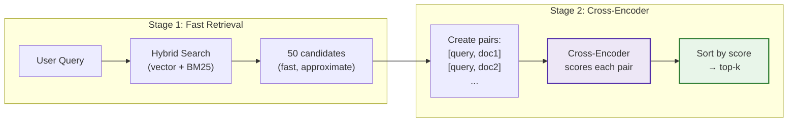

# Cross-Encoder Reranking

> **Model:** [mixedbread-ai/mxbai-rerank-large-v1](https://huggingface.co/mixedbread-ai/mxbai-rerank-large-v1) | MixedBread AI | MTEB Score: 57.49

A second-stage retrieval step that re-scores candidates using a cross-encoder model. The cross-encoder sees query and document together, enabling deeper semantic matching than embedding similarity alone.

**Type:** Post-retrieval reranking | **Model Size:** 560M params | **Latency:** ~1s CPU, ~0.1s GPU

---

## Diagram



---

## Theory

### The Core Problem

Bi-encoders (embedding models) process query and document separately:

```
Query: "What metaphor does Marcus Aurelius use?"
        ↓
    embed(query) → [0.23, 0.87, ...]  (1536-dim vector)

Document: "He likens humans to puppets moved by wires"
        ↓
    embed(doc) → [0.45, 0.21, ...]    (1536-dim vector)

Similarity = cosine(query_vec, doc_vec) → 0.67
```

The model never sees "metaphor" and "puppets" together, so it may miss that "puppets moved by wires" IS the metaphor being asked about.

### Cross-Encoder Solution

Cross-encoders process both texts simultaneously:

```
Input: "[CLS] What metaphor does Marcus Aurelius use? [SEP] He likens humans to puppets... [SEP]"
        ↓
    Full Transformer Attention (query attends to document, and vice versa)
        ↓
    Relevance Score: 0.95
```

The model sees both texts together, enabling it to understand that "puppets" directly answers the question about "metaphor".

### Research Background

Two-stage retrieval is the standard architecture in production search systems:

| Stage | Model Type | Speed | Accuracy | Purpose |
|-------|-----------|-------|----------|---------|
| **1. Retrieval** | Bi-encoder | Fast (~1ms) | Good | Cast wide net (50-100 candidates) |
| **2. Reranking** | Cross-encoder | Slow (~1s) | Best | Precise ranking of candidates |

**Key findings:**
- Cross-encoders achieve **20-35% higher precision** than bi-encoders alone
- Two-stage is optimal: cross-encoders are too slow for full corpus search
- Reranking 50→10 provides best cost/quality tradeoff

---

## Implementation in RAGLab

### Algorithm

```
1. Retrieve 50 candidates using hybrid search (fast, approximate)
2. Create [query, document] pairs for each candidate
3. Score all pairs with cross-encoder in a single batch
4. Sort by cross-encoder score (descending)
5. Return top-k results
```

### Key Design Decisions

| Decision | Value | Rationale |
|----------|-------|-----------|
| **Model** | mxbai-rerank-large-v1 | SOTA open-source (MTEB 57.49), Apache 2.0 |
| **Initial candidates** | 50 | Enough for recall, few enough for speed |
| **Lazy loading** | Singleton pattern | Avoid reloading 1.2GB model per call |
| **GPU auto-detect** | Yes | Uses CUDA/MPS if available, falls back to CPU |

### Model Comparison

```python
# Available models (src/rag_pipeline/retrieval/reranking.py)

# SOTA accuracy (default)
"mixedbread-ai/mxbai-rerank-large-v1"  # 560M params, MTEB 57.49

# Balanced
"BAAI/bge-reranker-v2-m3"              # Smaller, faster

# Fastest (lowest accuracy)
"cross-encoder/ms-marco-MiniLM-L-6-v2" # Very small, fastest
```

### Core Function

```python
# src/rag_pipeline/retrieval/reranking.py

def rerank(
    query: str,
    documents: list[SearchResult],
    top_k: int = 10,
) -> RerankResult:
    """Rerank documents using cross-encoder."""

    # Create query-document pairs
    pairs = [[query, doc.text] for doc in documents]

    # Score all pairs in batch (efficient GPU usage)
    scores = reranker.predict(pairs)

    # Sort by score, return top-k
    ...
```

### Bi-Encoder vs Cross-Encoder

```
Bi-Encoder (Embedding Model):
┌─────────────┐     ┌─────────────┐
│   Query     │     │  Document   │
└──────┬──────┘     └──────┬──────┘
       ↓                   ↓
   [Encoder]           [Encoder]    ← Same model, separate passes
       ↓                   ↓
   query_vec           doc_vec
       └───────┬───────┘
           cosine()
               ↓
           Similarity

Cross-Encoder (Reranker):
┌─────────────────────────────────┐
│   [CLS] Query [SEP] Doc [SEP]   │
└───────────────┬─────────────────┘
                ↓
       [Full Transformer]          ← Both texts see each other
                ↓
         Relevance Score
```

---

## Performance in This Pipeline

### When Reranking Helps Most

| Scenario | Without Rerank | With Rerank | Improvement |
|----------|---------------|-------------|-------------|
| Ambiguous queries | Moderate | High | +25-35% precision |
| Keyword mismatch | Low | High | Recovers missed matches |
| Top-1 accuracy | ~60% | ~80% | Critical for single-answer |

### Trade-offs

| Aspect | Impact |
|--------|--------|
| **Latency** | +1s CPU, +0.1s GPU |
| **Memory** | +1.2GB model load |
| **Accuracy** | +20-35% precision |

**Recommendation:** Enable reranking for production (accuracy matters), disable for evaluation grid search (speed matters).

---

## Cost Analysis

| Component | CPU | GPU |
|-----------|-----|-----|
| Model load (first call) | ~5s | ~3s |
| 50 documents | ~1s | ~0.1s |
| 100 documents | ~2s | ~0.2s |
| Memory | 1.2GB | 1.2GB VRAM |

No API costs — model runs locally.

---

## Running Reranking

```bash
# Via CLI (evaluation)
python -m src.stages.run_stage_7_evaluation --reranking

# Disable (default for speed)
python -m src.stages.run_stage_7_evaluation --no-reranking
```

Via UI: Toggle "Enable Cross-Encoder" in Streamlit sidebar.

### Configuration

```python
# src/config.py
RERANK_INITIAL_K = 50  # Candidates before reranking

# src/rag_pipeline/retrieval/reranking.py
RERANK_MODEL = "mixedbread-ai/mxbai-rerank-large-v1"
```

---

## When to Use

| Scenario | Recommendation |
|----------|----------------|
| Production Q&A | Enable — accuracy matters |
| Top-1 critical | Enable — biggest impact on first result |
| Grid search evaluation | Disable — speed matters |
| Debugging retrieval | Disable — see raw retrieval quality |
| GPU available | Enable — minimal latency impact |
| **Avoid when** | Latency-critical (<100ms), CPU-only with high QPS |

---

## Related

- [Preprocessing Overview](README.md) — Query-time transformations
- [Hybrid Search](../../memory-bank/evaluation-workflow.md) — Stage 1 retrieval
- [Evaluation Framework](../evaluation/README.md) — Reranking disabled by default for speed
