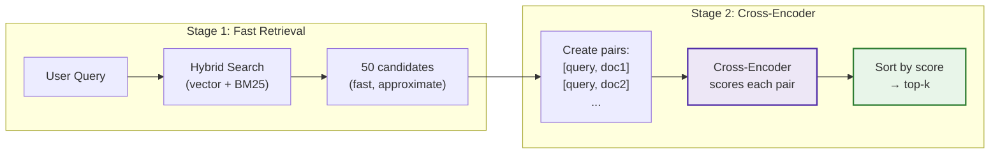

# Cross-Encoder Reranking

[← GraphRAG](graphrag.md) | [Home](../../README.md)

> **Model:** [mixedbread-ai/mxbai-rerank-xsmall-v1](https://huggingface.co/mixedbread-ai/mxbai-rerank-xsmall-v1) | MixedBread AI | BEIR NDCG: 43.9

A second-stage retrieval step that re-scores candidates using a cross-encoder model. The cross-encoder sees query and document together, enabling deeper semantic matching than embedding similarity alone.

**Type:** Post-retrieval reranking | **Model Size:** 70.8M params | **Latency:** ~3s CPU (50 docs), ~0.3s GPU

---

## Diagram



---

## Theory

### The Core Problem

Bi-encoders (embedding models) process query and document separately:

```
Query: "What metaphor does Marcus Aurelius use?"
        ↓
    embed(query) → [0.23, 0.87, ...]  (1536-dim vector)

Document: "He likens humans to puppets moved by wires"
        ↓
    embed(doc) → [0.45, 0.21, ...]    (1536-dim vector)

Similarity = cosine(query_vec, doc_vec) → 0.67
```

The model never sees "metaphor" and "puppets" together, so it may miss that "puppets moved by wires" IS the metaphor being asked about.

### Cross-Encoder Solution

Cross-encoders process both texts simultaneously:

```
Input: "[CLS] What metaphor does Marcus Aurelius use? [SEP] He likens humans to puppets... [SEP]"
        ↓
    Full Transformer Attention (query attends to document, and vice versa)
        ↓
    Relevance Score: 0.95
```

The model sees both texts together, enabling it to understand that "puppets" directly answers the question about "metaphor".

### Research Background

Two-stage retrieval is the standard architecture in production search systems:

<div align="center">

| Stage | Model Type | Speed | Accuracy | Purpose |
|-------|-----------|-------|----------|---------|
| **1. Retrieval** | Bi-encoder | Fast (~1ms) | Good | Cast wide net (50-100 candidates) |
| **2. Reranking** | Cross-encoder | Slow (~1s) | Best | Precise ranking of candidates |

</div>

**Key findings:**
- Cross-encoders achieve **20-35% higher precision** than bi-encoders alone
- Two-stage is optimal: cross-encoders are too slow for full corpus search
- Reranking 50→10 provides best cost/quality tradeoff

---

## Implementation in RAGLab

### Algorithm

```
1. Retrieve 50 candidates using hybrid search (fast, approximate)
2. Create [query, document] pairs for each candidate
3. Score all pairs with cross-encoder in a single batch
4. Sort by cross-encoder score (descending)
5. Return top-k results
```

### Key Design Decisions

<div align="center">

| Decision | Value | Rationale |
|----------|-------|-----------|
| **Model** | mxbai-rerank-xsmall-v1 | Best quality/speed for CPU + cross-domain corpus |
| **Initial candidates** | 50 | Enough for recall, few enough for speed |
| **Lazy loading** | Singleton pattern | Avoid reloading model per call |
| **GPU auto-detect** | Yes | Uses CUDA/MPS if available, falls back to CPU |

</div>

### Model Selection Analysis (Jan 2025)

Two benchmarks measure different things:

<div align="center">

| Benchmark | What It Measures | Best For |
|-----------|------------------|----------|
| **MS MARCO** | Web search queries, short passages | MiniLM models (trained here) |
| **BEIR** | Multi-domain: scientific, financial, medical | mxbai models (diverse training) |

</div>

**RAGLab corpus:** Philosophy + neuroscience books = cross-domain academic text, closer to BEIR than MS MARCO.

### Comprehensive Model Comparison

<div align="center">

| Model | Params | BEIR NDCG@10 | MS MARCO NDCG@10 | CPU Time (50 docs) | Training Data |
|-------|--------|--------------|------------------|-------------------|---------------|
| ms-marco-MiniLM-L-2-v2 | 15.6M | ~35* | 71.01 | ~125ms | MS MARCO only |
| ms-marco-MiniLM-L-6-v2 | 22.7M | ~38* | 74.30 | ~300ms | MS MARCO only |
| **mxbai-rerank-xsmall-v1** | **70.8M** | **43.9** | — | **~3s** | Diverse |
| mxbai-rerank-base-v1 | 200M | 46.9 | — | ~8s | Diverse |
| BAAI/bge-reranker-v2-m3 | 568M | ~45 | — | ~15s | Multilingual |
| mxbai-rerank-large-v1 | 560M | 48.8 | — | ~60s | Diverse |

</div>

*Estimated from BEIR subset evaluations

### Why mxbai-xsmall-v1?

1. **Cross-domain corpus:** Our philosophy + neuroscience books require diverse training (BEIR 43.9 vs ~38 for MiniLM)
2. **CPU-friendly:** 8x faster than large-v1, practical for development
3. **Quality retention:** Only 5 NDCG points below SOTA, but 20x faster on CPU
4. **Fallback option:** If still too slow, MiniLM-L-6 is 10x faster (sacrifice some cross-domain quality)

```python
# src/config.py - Model options

# Current choice (best for cross-domain CPU)
"mixedbread-ai/mxbai-rerank-xsmall-v1"  # 70.8M, BEIR 43.9

# Faster alternatives (if CPU is bottleneck)
"cross-encoder/ms-marco-MiniLM-L-6-v2"  # 22.7M, BEIR ~38, MS MARCO 74.3
"cross-encoder/ms-marco-MiniLM-L-2-v2"  # 15.6M, fastest, lowest quality

# Higher quality (GPU recommended)
"mixedbread-ai/mxbai-rerank-base-v1"    # 200M, BEIR 46.9
"mixedbread-ai/mxbai-rerank-large-v1"   # 560M, BEIR 48.8, SOTA
```

### Core Function

```python
# src/rag_pipeline/retrieval/reranking.py

def rerank(
    query: str,
    documents: list[SearchResult],
    top_k: int = 10,
) -> RerankResult:
    """Rerank documents using cross-encoder."""

    # Create query-document pairs
    pairs = [[query, doc.text] for doc in documents]

    # Score all pairs in batch (efficient GPU usage)
    scores = reranker.predict(pairs)

    # Sort by score, return top-k
    ...
```

### Bi-Encoder vs Cross-Encoder

```
Bi-Encoder (Embedding Model):
┌─────────────┐     ┌─────────────┐
│   Query     │     │  Document   │
└──────┬──────┘     └──────┬──────┘
       ↓                   ↓
   [Encoder]           [Encoder]    ← Same model, separate passes
       ↓                   ↓
   query_vec           doc_vec
       └───────┬───────┘
           cosine()
               ↓
           Similarity

Cross-Encoder (Reranker):
┌─────────────────────────────────┐
│   [CLS] Query [SEP] Doc [SEP]   │
└───────────────┬─────────────────┘
                ↓
       [Full Transformer]          ← Both texts see each other
                ↓
         Relevance Score
```

---

## Performance in This Pipeline

### When Reranking Helps Most

<div align="center">

| Scenario | Without Rerank | With Rerank | Improvement |
|----------|---------------|-------------|-------------|
| Ambiguous queries | Moderate | High | +25-35% precision |
| Keyword mismatch | Low | High | Recovers missed matches |
| Top-1 accuracy | ~60% | ~80% | Critical for single-answer |

</div>

### Trade-offs

<div align="center">

| Aspect | Impact |
|--------|--------|
| **Latency** | +1s CPU, +0.1s GPU |
| **Memory** | +1.2GB model load |
| **Accuracy** | +20-35% precision |

</div>

**Recommendation:** Enable reranking for production (accuracy matters), disable for evaluation grid search (speed matters).

---

## Cost Analysis

### mxbai-rerank-xsmall-v1 (Current)

<div align="center">

| Component | CPU | GPU |
|-----------|-----|-----|
| Model load (first call) | ~3s | ~2s |
| 50 documents | ~3s | ~0.3s |
| 100 documents | ~6s | ~0.6s |
| Memory | ~300MB | ~300MB VRAM |

</div>

### Comparison Across Models

<div align="center">

| Model | CPU (50 docs) | Model Size | Download |
|-------|---------------|------------|----------|
| MiniLM-L-2-v2 | ~125ms | ~60MB | ~30MB |
| MiniLM-L-6-v2 | ~300ms | ~90MB | ~45MB |
| **mxbai-xsmall-v1** | **~3s** | **~280MB** | **~140MB** |
| mxbai-base-v1 | ~8s | ~800MB | ~400MB |
| mxbai-large-v1 | ~60s | ~2.2GB | ~1.1GB |

</div>

No API costs — model runs locally.

---

## Running Reranking

```bash
# Via CLI (evaluation)
python -m src.stages.run_stage_7_evaluation --reranking

# Disable (default for speed)
python -m src.stages.run_stage_7_evaluation --no-reranking
```

Via UI: Toggle "Enable Cross-Encoder" in Streamlit sidebar.

### Configuration

```python
# src/config.py
RERANK_MODEL = "mixedbread-ai/mxbai-rerank-xsmall-v1"  # See model comparison above
RERANK_INITIAL_K = 50  # Candidates before reranking
```

---

## When to Use

<div align="center">

| Scenario | Recommendation |
|----------|----------------|
| Production Q&A | Enable — accuracy matters |
| Top-1 critical | Enable — biggest impact on first result |
| Grid search evaluation | Disable — speed matters |
| Debugging retrieval | Disable — see raw retrieval quality |
| GPU available | Enable — minimal latency impact |
| **Avoid when** | Latency-critical (<100ms), CPU-only with high QPS |

</div>

---

## References

- [mxbai-rerank-xsmall-v1 - HuggingFace](https://huggingface.co/mixedbread-ai/mxbai-rerank-xsmall-v1)
- [MS MARCO Cross-Encoders - SBERT](https://www.sbert.net/docs/pretrained-models/ce-msmarco.html)
- [Reranking Benchmarks arXiv:2409.07691](https://arxiv.org/html/2409.07691v1)
- [Metarank Cross-Encoder Benchmarks](https://docs.metarank.ai/guides/index/cross-encoders)
- [SBERT Efficiency Guide](https://sbert.net/docs/cross_encoder/usage/efficiency.html)

---

## Navigation

**Next:** [Evaluation Framework](../evaluation/README.md) — RAGAS metrics and testing

**Related:**
- [Preprocessing Overview](README.md) — Query-time transformations
- [Evaluation Framework](../evaluation/README.md) — Reranking disabled by default for speed
